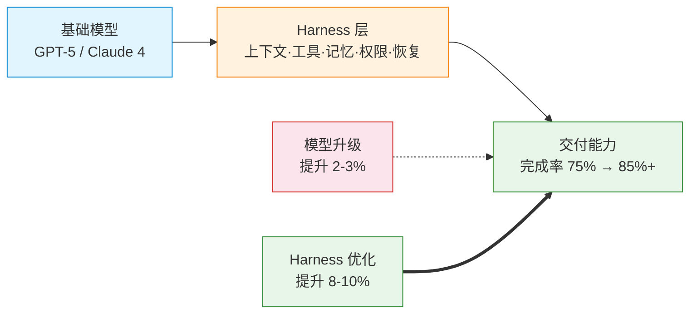

## 一、引子

2026 年 7 月 23 日，北京市发改委等四部门联合发了一份文件——《北京市关于加快智能体引领发展的若干措施》。十条措施，最高 1 个亿的资金支持。

这本身不是新闻。真正有意思的是文件里出现的词汇。

Harness Engineering（驾驭层工程）、FDE（前沿部署工程师）、AIP（智能体互联协议）、OPC（一人公司）、Token 经济、TaaS/AaaS/RaaS、需求智能、AI OS、Token 工厂——一共九个此前只在技术社区流传的词，白纸黑字写进了官方公文。

同一天，LinkedIn 发布数据：2023 至 2025 年，全球 FDE 招聘岗位增长了 **42 倍**，是同期 AI 工程师增速（13 倍）的三倍还多。OpenAI 砸了 40 亿美元成立部署公司 DeployCo，收购了 Tomoro 带来 150 名 FDE。Anthropic 联合黑石和高盛成立 15 亿美元合资企业。国内字节跳动给 FDE 开出了最高 105 万的年薪。

这些看似分散的新闻，背后其实贯穿着一条暗线——**AI Native**。这个词在 2024-2025 年还被当成 Buzzword，到 2026 年已经变成实实在在的战略选择。它不是在现有系统上"接入 AI"当插件，而是从第一天起就以 AI 为默认基础设施来设计产品、搭建组织、定义商业模式。FDE、Harness、AIPM、OPC、Token Economy——每一条都在回答同一个问题：一个真正 AI Native 的世界应该长什么样？

模型还在卷，但风向已经变了。

---

## 二、FDE：最烫手的"新工种"

FDE，全称 Forward Deployed Engineer，前沿部署工程师。

这个词不是 2026 年凭空造出来的。它最早来自 Palantir——那家以大数据分析闻名的硅谷公司。Palantir 的工程师不是坐在办公室写代码，而是直接进驻客户现场，和业务人员坐在一起，把那些"没写下来的规则"变成可运行的系统。

2026 年为什么突然爆了？三个字：落不了地。

MIT 2025 年的报告说，95% 的企业 GenAI 试点没有可衡量的商业影响。不是模型不够强——GPT-5、Claude 4、Gemini 3 一个比一个猛——但企业买了之后发现：数据是乱的，流程是散的，人是不会用的。你给一个传统制造企业的车间主任装一个 ChatGPT 界面，他只觉得你在开玩笑。

FDE 就是被派去填这个坑的人。

### 争议也不少

很多人觉得这就是"新瓶装旧酒"。解决方案架构师、实施顾问、项目经理——这些岗位做了二十年类似的事，换了个 AI 的名字就成香饽饽了？

这个质疑有道理，但我觉得有几个关键区别：

**第一，杠杆变了。** 一个 FDE 现在能同时覆盖产品经理、技术架构师、项目经理、AI 工程师四个角色的工作。AI 编程工具把写代码的成本打到了接近零，一个人能端到端搞定的事情范围比以前大了不止一个数量级。

**第二，没有 best practice。** 以前是"上个 ERP"——流程是确定的，照着来就行。现在是"把大模型接进你的生产流程"——每个客户的场景都是全新的，文档？不存在的。

**第三，翻译成本才是真正的瓶颈。** 企业知道自己想要"降本增效"，但说不清楚具体要让 AI 做什么。FDE 最核心的工作是翻译：把业务语言翻译成模型能理解的指令，再把模型的输出翻译回业务能看懂的结果。

我也认同一个判断：**FDE 大概率是个过渡性岗位。** 两三年后，AI 落地方案逐步定型，企业会回到采购成熟方案的模式。这个专门的岗位可能会消失。但 FDE 背后的那套能力——连接技术与业务的"翻译能力"——会留下来，变成每个工程师的标配。

---

## 三、Harness Engineering：模型之外才是主战场

如果说 FDE 解决的是"人"的问题，Harness Engineering 解决的就是"系统"的问题。

北京新政把它翻译成"驾驭层工程"。听起来硬核，道理其实简单：

**模型提供的是"潜在能力"，Harness 决定的是"交付能力"。**

你有一个 GPT-5，它理论上能做很多事情。但要让它在你的业务场景里稳定干活，需要在模型外面包一层：上下文管理、工具调用、长期记忆、权限控制、状态管理、异常恢复、结果验证。这一整套，就是 Harness。

有一组数据很说明问题：保持基础模型不变，仅优化工具链、中间件、记忆和执行框架，Agent 任务完成率能提升近 **10 个百分点**。10 个百分点什么概念？比换一代模型的提升还大。

**这个数据指向一个结论：2026 年最大的产业机会不在基础模型，而在 Harness 层。**

回顾一下时间线：2023 年卷参数规模，2024 年卷上下文窗口，2025 年卷 Agent 框架。2026 年，最热门的讨论变成了 Harness Engineering、Skills、MCP、上下文工程——全部都是模型之外的东西。范式确实在变。

这也正是 **AI Native 的架构含义**。传统软件架构里模型是"外挂"——你想加 AI 功能，调一个 API 完事。但 AI Native 的架构里，模型不是被"接入"系统的，系统从底层就围绕模型运转：工具链是模型的一部分，记忆是模型的一部分，权限和恢复机制也是。Harness 不是"模型的外包装"，它就是 AI Native 应用的完整形态。

---

## 四、AIPM：国家队出手，给每个 Agent 发一张"身份证"

如果 FDE 解决人的问题、Harness 解决系统的问题，那 **AIPM（Agent Interconnection Protocol Model，智能体互联协议体系）** 解决的就是**生态的问题**——不同厂家、不同平台的 Agent 之间怎么"说话"、怎么找到彼此、怎么互信。

2026 年 6 月，国家市场监管总局正式批准发布了 **GB/Z 185—2026《人工智能 智能体互联》系列国家标准**，共 7 项。这是行业首套智能体互联国标，不是推荐，是指南性质的顶层规范。牵头单位是中国电子技术标准化研究院，联合北京邮电大学和 70 多家产学研单位。

### 七层标准体系

这 7 项标准构成了一个完整的闭环：

| 部分 | 内容 | 一句话定位 |
|------|------|-----------|
| 第 1 部分 | 总体架构 | 顶层设计，明确互联技术方案长什么样 |
| 第 2 部分 | 身份码 | 给每个 Agent 发一张"数字身份证"（AIC） |
| 第 3 部分 | 身份管理 | 注册、变更、注销、鉴权，全生命周期管起来 |
| 第 4 部分 | 智能体描述 | Agent 的能力画像——"我能干什么"写得清清楚楚 |
| 第 5 部分 | 智能体发现 | 供需匹配机制——怎么找到"能干事"的那个 Agent |
| 第 6 部分 | 智能体交互 | 多 Agent 协同的核心规则和通信接口 |
| 第 7 部分 | 智能体工具调用 | 统一外部工具的描述规范和调用流程 |

最值得关注的是第 2 和第 3 部分——**身份码（AIC）**。这套体系基于国家规范的 OID 体系，给每个 Agent 颁发唯一的"数字身份证"。截至 2026 年 7 月，已有超 200 家节点完成备案，授权核心身份码 1181 个，意向申领总量达 13526 个。这意味着什么？意味着 Agent 不再是一个匿名账号，它能被追溯、被审计、被信任。

### 不是 PPT，是真落地

AIPM 目前不是停留在纸面上的标准。2026 年 7 月 7 日，基于国标的 AIP 开源项目在 AtomGit 正式上线（同期也在 GitHub 开源），已发布 v2.1.0，下载量突破 6000 次。工具套件包括 AIP SDK、兼容 Skill/MCP 的接入套件——也就是说，现有的 MCP 生态可以和 AIP 互通。

7 月 21 日，美团、去哪儿、滴滴、智谱、用友、联想等 **38 家**企业签署了《AIP 生态合作倡议》。首批试点覆盖制造、农业、金融、医疗、教育等领域。

对比国际上现有的 Agent 协议（Google 的 A2A、Anthropic 的 MCP），AIPM 有三个鲜明特点：

- **身份优先**：A2A 和 MCP 都没解决"我怎么知道对面是谁"的问题，AIPM 从第一天就把身份认证做进了协议底层。
- **群组协作**：不是简单的点对点通信，而是支持"群聊"模式——多个 Agent 组队完成任务，协作效率比逐个串联高一个量级。
- **标准 + 代码同步走**：标准发布的同时开源项目就上线了，这在国标体系里极其罕见。

简单类比：**HTTP 定义了网页怎么被访问，AIPM 定义了 Agent 怎么被调用。** 但 HTTP 诞生于互联网早期，是一步步长成今天这个样子的。AIPM 是政府、企业、开源社区三方同时推动，起点比当年高得多，但过程也更复杂——毕竟 38 家企业的利益不是靠一个协议文本就能对齐的。

---

## 五、OPC：一个人 + AI = 一个公司

OPC，One Person Company，一人公司。

北京政策专门用了一条来支持 OPC：简化注册流程、提供弹性算力、建设 OPC 社区和全周期服务站。海淀区已经聚集了近 180 家 OPC 企业。

这听起来很科幻，但逻辑链条其实很清楚：AI 正在同时压低执行成本和协调成本。写代码、做设计、理客户、回咨询、处理报表——这些以前需要一整个团队协作的知识工作，现在一个人加几套 Agent 就能串起来。企业的最小可行规模，正在从几十人降到几个人，甚至一个人。

但我也想泼盆冷水：**OPC 真正的瓶颈不在工具，而在"知道什么问题值得解决"。**

AI 降低了执行成本，但没有降低"判断该做什么"的成本。一个人能干的活变多了，但一个人能看清的方向并没有变多。你让一个程序员用 AI 做一个 App，三天就能搞出来。但你让他决定"该不该做这个 App、卖给谁、怎么定价"——AI 帮不了这个忙。

所以政策里配套的"全周期服务站"和"创业辅导"，在我看来可能比算力券更关键。

这背后其实是 **AI Native 的组织含义**。为什么一个人能做一个公司的事？因为在 AI Native 的设定里，AI 不是你需要额外接入的工具，而是像水电一样默认就在那里——代码是 AI 写的，设计是 AI 做的，客服是 AI 回的，财务是 AI 对的。人只做两件事：决定做什么，以及检查做得对不对。这不只是效率提升，而是组织的最小可行单元被重新定义了。

---

## 六、Token Economy：从卖算力到卖结果

政策里最有冲击力的一句话是："鼓励创新主体从 Token 消耗量计费转向价值计费。"

AI 行业的商业模式正在经历三层跃迁：

| 层级 | 模式 | 卖什么 | 供应商风险 |
|------|------|--------|-----------|
| 第一层 | TaaS（Token 即服务） | 算力和推理吞吐 | 价格战，毛利越来越薄 |
| 第二层 | AaaS（智能体即服务） | 封装好的 AI 能力 | 需要向客户证明 ROI |
| 第三层 | RaaS（结果即服务） | 最终交付成果 | 承担失败、返工和赔偿责任 |

RaaS 是终极形态。客户不为 Token 付费，不为模型付费，甚至不为 Agent 付费——只为结果付费。你说 AI 能帮我审合同，审完了才算钱。审错了、漏了，你来承担。

这听起来对客户很友好，但对供应商来说压力巨大。目前敢真正走 RaaS 模式的公司很少。但我觉得，未来三年这可能是整个 AI 行业最大的商业模式变革——不是因为技术上可行了，而是因为客户已经厌倦了为"潜在能力"买单，他们要的是"干成了再说"。

配套的"Token 工厂"和"银河算廊"工程——前者解决供给：把算力变成像水电一样标准化的 Token；后者解决调度：把"小散算力零存整取"——本质都是在为这个商业模式转型打基础设施。

---

## 七、所以这些词到底在说什么？

把 FDE、Harness、AIPM、OPC、Token Economy 放到一起看，线索很清楚了：

**AI 产业的焦点正在从"模型有多聪明"转向"AI 能不能稳定地完成一件真事"。**

2023-2024 年，所有人问的是"模型能不能做到这个"。
2025 年，问的是"Agent 能不能执行这个"。
2026 年，问题变成了**"谁能把这件事真正交付出来"**。

这五个词分别回答了"交付"的不同侧面：

- **FDE** → 谁来填最后一公里的坑（人）
- **Harness Engineering** → 怎么让模型稳定干活（系统）
- **AIPM** → Agent 之间怎么互信互认（协议+标准）
- **OPC** → 一个人能不能跑通全栈（组织）
- **Token Economy** → 按什么方式收钱（商业）

北京政策把这批词写进官方文件，说明这已经不是技术圈的自嗨。产业共识正在形成。

而贯穿所有这些词的那条暗线——**AI Native**——才是真正的结构变化。它不是某一项技术突破，而是整个社会开始默认 AI 是基础设施的一部分。就像今天我们不会特意说"Cloud Native 公司"一样，几年后"AI Native"这个词可能也会消失，因为它已经变成默认值了。

**谁会在这波里受益？**

我觉得继续卷基础模型的人和大多数人没关系——那是 OpenAI、Anthropic、Google 的战场。真正受益的可能是：

1. **能动手落地的全栈工程师**——不一定最懂算法，但能出差、能驻场、能理解客户在说什么
2. **深耕垂直行业的人**——懂医疗、懂法律、懂制造、懂物流，比纯 AI 工程师值钱得多
3. **愿意试错的人**——OPC 的启动成本低到可以忽略，不需要融资、不需要团队，一个人加几套 Agent 就能开始

AI 的上半场比的是"谁的模型更聪明"。
下半场比的是"谁能把事情干成"。

从 FDE 到 Token Economy，九个词，说的都是同一件事：**AI Native 不再是概念，它正在变成现实。**
