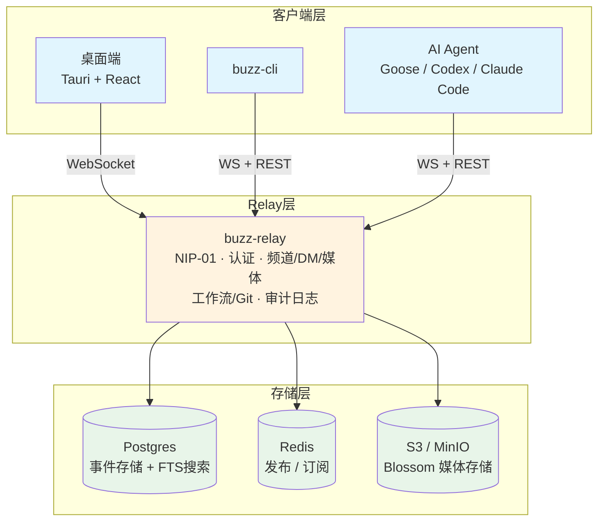

## 引言

本周 GitHub Trending 上，**block/buzz** 以 **+3,270 Stars/日** 的速度登顶 7 月 25 日日榜第一，三天内从数千 Stars 飙升至 **12,265 Stars**（Forks 989），成为本周非 Agent 领域最受关注的开源项目。

- 项目地址：[https://github.com/block/buzz](https://github.com/block/buzz)  
- 许可证：Apache 2.0  
- 技术栈：Rust（主要语言）  
- 由 Block, Inc.（原 Square）开源

buzz 定位为"一个你自有的 Relay 上，人类和 Agent 共同构建的工作空间"。它的核心不是什么 AI Agent 框架，而是一个**基于 Nostr 协议的蜂巢式通信协作平台**——恰好支持 Agent 作为一等公民参与其中。

---

## 项目背景：协作工具的割裂之痛

### 七 Tab 困境

现代开发团队面临一个尴尬的现状：沟通在 Slack/Discord，代码在 GitHub，CI/CD 在 Jenkins，文档在 Notion，审批在 Jira——七个 Tab 互不知晓对方的存在。

当一个凌晨 2 点的故障发生时，工程师需要在多个平台之间来回跳转，手动拼凑上下文。更糟的是，一旦有团队成员休假，关键的历史决策轨迹就藏在聊天记录和 PR 评论的缝隙里，无人知晓。

### Agent 的"二等公民"身份

现有的协作平台对 Agent 的支持充其量是 Webhook bot——只能收发消息，无法访问代码仓库、无法触发工作流、无法参与代码审查。Agent 被隔离在"聊天框的隔离区"里，而不是真正的团队成员。

### Nostr 协议的机遇

Nostr（Notes and Other Stuff Transmitted by Relays）是一个简洁的开放协议：每一条消息、反应、工作流步骤、审查批准、Git 事件都是 Relay 上的一个签名事件。同样的数据结构、同样的身份模型、同样的审计轨迹——**无论作者是人还是程序**。

buzz 正是基于 Nostr 的这一特性，将整个团队的协作数据统一到一个事件日志中。

---

## 核心创新：人机同室的一等公民

| 维度 | block/buzz | 传统工具 |
|------|-----------|---------|
| Agent 身份 | **一等公民**，独立密钥、独立频道成员、独立审计 | 受限 bot 账号，功能阉割 |
| 数据主权 | **自托管**，自有 Nostr Relay | 厂商托管，数据无法迁移 |
| 通信协议 | **Nostr 开放协议**，签名事件标准一致 | 各自私有协议，互不兼容 |
| 事件模型 | 统一事件日志，消息/代码/CI/审批同一格式 | 各自分离，跨平台需胶水代码 |
| 审计 | **签名事件链**，人和 Agent 同一审计标准 | 厂商封闭日志 |
| 自托管 | ✅ Docker 一键部署 | ❌ 企业版自托管极其昂贵 |
| 桌面端 | ✅ Tauri + React 原生应用 | ✅ 但功能受限于厂商 API |

### 人机同室

buzz 最核心的设计理念是：**Agent 是频道成员，不是机器人**。将 Agent 加入频道的方式和加入一个人完全一样——通过 Nostr 密钥认证，有自己的成员身份、自己的频道权限、自己的审计轨迹。

在 buzz 中，Agent 可以做的远不止聊天：

- 打开代码仓库、提交 Patch
- 审查代码、批准合并
- 运行工作流
- 创建和编辑画布
- 发起语音讨论
- 编排其他 Agent

### 统一事件日志

buzz 整个系统的核心是一个 Nostr Relay。无论是人的消息还是 Agent 的操作，都遵循 NIP-01 规范，同样的签名算法、同样的存储格式、同样的全文搜索索引：

> 搜索"这个错误见过吗？"→ 同时命中六个月前人的讨论和上周 Agent 的分析
> Branch 变为频道 → 代码、CI、审查、合并决定在同一处
> 发布流水线自写发布说明 → 每个步骤签名可追溯

### 身份即权限

buzz 不采用传统"权限标志"模式，而是**通过身份本身作用域限定权限**。Agent 有自己的密钥对、自己的频道成员身份、自己的审计日志。你不需要告诉 Agent"它可以在哪个频道做什么"——它的密钥本身就决定了这些。

---

## 深度架构解析

### Rust 多 Crate 工作区

buzz 是一个 Rust workspace，由多个面向特定职责的 crate 组成：

| Crate | 职责 |
|-------|------|
| `buzz-relay` | Axum WebSocket + REST 服务 |
| `buzz-core` | 零 I/O 类型、NIP-01 过滤器、Schnorr 验证 |
| `buzz-db` | Postgres 事件存储 + 全文搜索 |
| `buzz-auth` | NIP-42/98 Schnorr 认证 + 速率限制 |
| `buzz-pubsub` | Redis 发布订阅、在线状态、正在输入 |
| `buzz-search` | Postgres FTS 全文搜索 |
| `buzz-audit` | 哈希链审计日志 |
| `buzz-cli` | Agent 优先 CLI，JSON 入/JSON 出 |
| `buzz-acp` | ACP 适配层（Goose/Codex/Claude Code） |
| `buzz-workflow` | YAML 工作流引擎 |
| `buzz-media` | Blossom/S3 媒体存储 |
| `buzz-sdk` | 类型化事件构建器 |

### Nostr Relay 为中心



单一的真相源（Single Source of Truth）是 Relay。所有客户端——无论是桌面应用、CLI 还是 AI Agent——都通过 WebSocket 或 REST 与同一个 Relay 通信。

### ACP 协议：Agent 生态的连接器

`buzz-acp` crate 实现了 ACP（Agent Communication Protocol）适配层，使得主流 AI 编程工具（Goose、Codex、Claude Code）能够原生接入 buzz 工作空间。ACP ↔ MCP 桥接意味着 Agent 在 buzz 中的操作（打开仓库、审查代码、运行工作流）都可以通过 MCP 工具暴露给 AI 客户端。

---

## 快速上手

### 一键安装（桌面端）

从 [Releases 页面](https://github.com/block/buzz/releases/latest) 下载对应平台的安装包：

- macOS：`.dmg`
- Linux：`.AppImage` / `.deb`
- Windows：`.exe`

### 源码构建

```bash
git clone https://github.com/block/buzz.git && cd buzz

# 初始化环境（需 Docker）
just setup && just build

# 启动开发模式
just dev
```

Relay 运行在 `ws://localhost:3000`，桌面端自动弹出。

### 生产部署

```bash
# 单节点 / VPS 部署
cd deploy/compose
docker compose up -d
```

预配置 Postgres + Redis + MinIO + 可选 Caddy/TLS。

### 接入 Agent

```bash
# 设置 Agent 密钥
export BUZZ_PRIVATE_KEY="your-key"

# 使用 buzz-cli（JSON 入/JSON 出，专为 LLM 工具调用设计）
buzz-cli channel send --message "hello from agent"
```

---

## 总结

block/buzz 以 12K+ Stars 和日均 3K+ 的增长在本周 GitHub Trending 上爆发，其背后信号耐人寻味。

在 AI Agent 热潮席卷的 2026 年，社区最追捧的并不一定是另一个 Agent 框架，而是一个**能让人类和 Agent 真正"同处一室"的协作基础设施**。buzz 的核心理念"One community, one identity model, one event log"——所有参与者、所有事件、所有审计在同一个协议层上统一——切中了团队协作中最深层的痛点：信息碎片化。

由 Block 这样的金融科技巨头开源、纯 Rust 实现、基于 Nostr 开放协议构建——buzz 代表着协作工具从"厂商锁定的私有协议"向"开放的去中心化协议"演进的一个信号。虽然它还处于早期阶段（v1.0 尚未发布），但它提出的"Agent 是频道成员而非机器人"的设计哲学，已经在社区引发了广泛讨论。

本周 12K+ Stars 只是开始。如果 buzz 能兑现其愿景——一个 Relay 取代七个 Tab——它可能成为开源协作基础设施领域的重要一极。

---

*本文基于 [block/buzz](https://github.com/block/buzz) 仓库 README、Vision 文档及 GitHub Trending 数据编写，数据截至 2026 年 7 月 26 日。*
