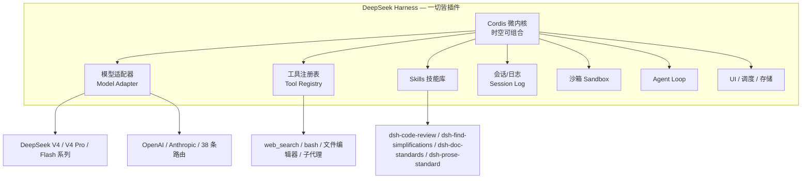
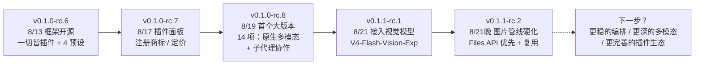

## 引言

> *"闭源为用户提供现在，开源让用户自己掌握未来。"*
> —— 崔添翼（Tianyi Cui），DeepSeek Harness 项目负责人

2026 年 8 月 13 日深夜，DeepSeek 没有开发布会，直接在 GitHub 上将 **`deepseek-ai/deepseek-harness`**（命令行工具 `dsh`）以 **MIT 协议**公开。社区一眼认出这片"无预告的鲸"——它被昵称为 **"黑鲸"（Black Whale）**。

热度来得比任何一次模型发布都猛：发布 **2 小时破 1 万星**，**12 小时破 5 万星**，**24 小时冲上约 8.03 万星**，**4 天（8/17）累计 14.9 万星**，首周突破 16.5 万——单日 Stars 增量甚至超过 Grok-1 自 2024 年 3 月以来的历史总量。*（不同来源的统计口径略有差异，天数与星数有出入，这里取多来源的共识区间）*

更值得注意的不是 14.9 万这个数字，而是它背后的速度：开源后的 **12 天里连续放了 5 个版本**（`v0.1.0-rc.6` → `v0.1.1-rc.2`），社区称之为"一周三更"。这不是一个"发完就收工"的框架，而是一个被当作独立产品在疯狂迭代的执行层。这篇文章我就帮你把这 12 天内每一次重磅更新拆开来看。

---

## 项目背景：为什么 DeepSeek 要把"执行层"开源？

### 从"模型时代"到"交付时代"

2026 年是 AI 产业从"卖模型"转向"交付能力"的转折年。我在《从 FDE 到 OPC：2026 年 AI 新名词里的产业转向》那篇里提过，FDE、Harness Engineering、AIPM 这类岗位需求暴涨，本质上是同一件事：**模型很多，但让模型能稳定干活的东西稀缺**。

这一年也流行起一个重要公式：

$$
\text{Agent} = \text{Model} + \text{Harness}
$$

模型负责"思考"，Harness（执行层 / 外壳）负责"干活"——调用工具、读写文件、编排流程、管理上下文、调度子代理、审批与审计。**谁控制了 Harness，谁就定义了 AI 在你电脑上能读哪些文件、能跑哪些命令、日志存在哪。**

也正是这个逻辑，让 DeepSeek 的这一步格外关键：它有国内最完整的开源模型矩阵（V4 系列），如今再把"模型 + 外壳"这一整套闭环开源出来，成为**首个能在"模型 + 工程外壳"层面完整对标 Anthropic 的中国厂商**——直接迎战 Claude Code、OpenAI Codex、GitHub Copilot。

### Harness Engineering 的行业背景

在《Prompt 已死，Loop 当立：黄仁勋引爆的 AI 范式革命》里，我把 AI 编程的演进分成四段：Prompt → Context → Harness → Loop。2025-2026 正是 **Harness Engineering** 的爆发期——`Skills`、`MCP Server`、沙箱、工具链、审批策略层出不穷，Agent 从"对话的玩具"变成"执行的系统"。

DeepSeek Harness 就是在这个语境下放出的。它做的不是又一款编码 Agent，而是一个**能自己吸进各种 Agent / 工具 / 模型的插件底座**——这正是它跟 Claude Code、Codex 的差异化：别人是"造一个 Agent 给你用"，它是"给你一套能自己攒 Agent 的乐高"。

---

## 核心创新：一切皆插件，连 Agent Loop 都是

传统的 Agent 框架，通常是"一个固定内核 + 一堆可插拔的扩展"。DeepSeek Harness 把这个模型彻底反过来：**没有强制内核，每个组件——包括 Agent Loop 本身——都是插件。**

### "一切皆插件"到底指什么

| 组件 | 传统框架 | DeepSeek Harness |
|------|---------|------------------|
| **模型适配器** | 内置固定 | 可插拔（38 条内置路由，15 家国产 + Anthropic/OpenAI） |
| **工具注册表** | 硬编码 | 可插拔，`web_search`/bash/文件编辑随需加载 |
| **Skills 技能库** | 附加扩展 | 核心能力，内置一批开发向 Skill |
| **会话日志 / 存储** | 藏在内部 | 可插拔（SQLite 后端可替换） |
| **沙箱** | 内定 | 可插拔 |
| **Agent Loop** | 框架特权 | **也是插件**——可替换、可实验 |
| **UI / 调度** | 绑定 | 可插拔 |
| 内核与扩展的界限 | 明显 | **没有"特权核心"，没有需要 patch 的底层** |

官方原话是"**没有需要 patch 的特权核心**"。所谓 plugin，不只是外围小工具，而是从模型、工具、技能、会话、沙箱、存储、Agent Loop、调度到 UI 的每一层都能独立拆换。

### 底层的 Cordis 微内核

这套"一切皆插件"的建筑师，是 DeepSeek 与北大联合论文《A Programming Paradigm for Spatiotemporal Composability》提出的元框架 **Cordis**，核心是**时空可组合性（spatiotemporal composability）**：

> 组件可以在运行时动态加载 / 卸载 / 替换，框架会自动**逆向副作用**、**解析依赖变更**，插件热插拔不留残骸、不崩应用——卸载时的清理是自动完成的。

如果模型、工具、Agent 驱动之间的组合能像乐高一样自由拆装，那"灵活到极致"就不再是口号。

### 四种 Agent 预设

| 模式 | 工具集 | 适合 |
|------|--------|------|
| **标准模式（Standard）** | 全量：文件编辑、CLI、检索、Skills、规划、子代理、工作流 | 日常开发 |
| **PTC 模式** | 程序化工具调用（Programmatic Tool Calling） | 自动化流水线里的多步编排 |
| **极简模式（Minimal）** | 仅 CLI + 文件编辑器 | 快速、低开销 |
| **创造模式（Creative）** | 环境探测 + 插件实验 | 插件研发、自定义预设 |

### 架构总览



---

## 详细解析：开源 12 天五版更新史

这是本文的核心。我们把 `v0.1.0-rc.6` 到 `v0.1.1-rc.2` 的时间线铺开，每版看定位、看改了什么、看为什么重要。

### 时间线总览

| 版本 | 发布 | 定位 | 关键词 |
|------|------|------|--------|
| **v0.1.0-rc.6** | 8/13 | 开源首版（开发者预览） | 一切皆插件、Cordis、4 预设、38 模型路由 |
| **v0.1.0-rc.7** | 8/17 | 小步快跑 | 插件自注册设置卡片、Cordis 动态插件面板、商标注册 |
| **v0.1.0-rc.8** | 8/19 | **首个大版本（14 项更新）** | 原生多模态、Claude Code/Codex 收编成子代理、Windows 持久 PowerShell |
| **v0.1.1-rc.1** | 8/21 | 多模态模型接入 | 引入 DeepSeek-V4-Flash-Vision-Exp、`/goal` `/plan` 图像输入 |
| **v0.1.1-rc.2** | 8/21 晚 | **图片管线硬化** | Files API 优先上传 + 复用、图片预处理自动缩放转格式 |

版本号停在 `0.1` 段，官方一句"**THERE WILL BE COMPATIBILITY-BREAKING CHANGES**（会有破坏兼容性的变更）"明明白白告诉你：这是开发预览期，发版即重构。

### v0.1.0-rc.6（8/13）：一切皆插件开源

第一版把框架主张整个端出来了：

- **仓库**：`deepseek-ai/deepseek-harness`，MIT 协议
- **命令**：`npx @deepseek-ai/dsh web` 一键起 Web UI（默认 `127.0.0.1:3080`）
- **大规模代码库**：`packages/`、`apps/`、`examples/`、`python/`、`native/`、`vendor/`、`website/` 跨 230+ 工作区成员
- **100+ 内置插件**，社区生态入口用 GitHub topic `dsh-plugin`
- **四种 Agent 预设** + **38 条模型路由**（15 家国产：DeepSeek、蚂蚁、月之暗面、MiniMax、Qwen、小米、智谱，外加 Anthropic/OpenAI 与自定义端点兼容）

这一发布与 **DeepSeek-V4-Pro-0813**（1.6 万亿参数 MoE，1M 上下文）同天放出，等于"模型 + 执行层"一起开闸。24 小时内 GitHub 上 `dsh-plugin` 主题下就冒出了 **1300+ 第三方仓库**。

围绕第一版，社区和第三方很快补位：图像理解（dsh-vision、dsh-vision-toolkit、dsh-auto-vision）、长期记忆、飞书接入、Token 统计、桌面客户端（dsh-desktop）、模型接入（dsh-commandcode-provider）、多模态工作流（dsh-tongflow）……生态在某年某月里像疯了一样生长。好消息？MIT 协议下，DeepSeek 明确鼓励插件作者用 `dsh-plugin` 主题标注，把插件生态打通。

### v0.1.0-rc.7（8/17）：小步快跑与"商标保卫"

隔了 4 天，rc.7 是一次小而稳的迭代：

- 插件**自注册设置卡片**
- 优化 **Cordis 动态插件面板**
- 同期宣布 **"DeepSeek Harness" 为注册商标**，并给出品牌使用规范

同一天（8/17），DeepSeek 宣布 **API 峰值/低谷期差异化定价**。这两件事连在一起看很有意思：模型涨价、框架注册商标——DeepSeek 在把 Harness 从"开源技术"往"收费能力 + 品牌资产"的路子上推。

### v0.1.0-rc.8（8/19）：首个大版本，14 项更新主打多模态

这是公开测试后第一次成规模的更新，**14 项调整**横跨多模态、子代理协作、终端体验、工具调用和开发者支持，释出信息量极大：

**① 多模态是主角**
- DeepSeek 模型适配器可开启**原生图像请求**，视觉模型直接吃图
- `/goal`、`/plan` 命令支持**图文混合输入**；输入框 `@` 菜单新增**文件与会话引用**
- 对**没视觉能力**的模型，走一条降级工具链：**OCR 文本识别、颜色占比统计、像素行扫描** + 读取尺寸与色彩模式，把结构化结果喂给文本模型再重建近似画面。对 PPT 截图、流程图、UI 截图效果好，对真实照片/复杂空间场景有限
- 社区插件 dsh-vision、modlens、dsh-subagent-vision、pi-vision（经 pi2dsh）等已来填这个坑

**② 把 Claude Code / Codex 收编成子代理**
- **Claude Code 与 Codex** 可按需以 **Profile Bundle** 安装为子代理
- Codex 新增**非交互权限模式**与**多个命名实例**支持——一个任务里可以跑不同名字的 Codex 子代理

**③ Windows 终端体验**
- PTY 终端支持**持久 PowerShell 会话**，极简模式的默认预设里默认开启，减少命令执行时反复重建终端环境

**④ Bug 修复**
- 单张超大图 / 历史里累积图片过多导致请求失败的问题
- 流式生成取消后，已展示的回复前缀没带到下一问或 forked 会话的问题
- 部分自定义 OpenAI 兼容网关的调用失败（请求格式差异 + 推理内容缺失）

**⑤ 开发者与性能**
- `web_search` 支持**并发查询**；子代理 `reportDelivery` **及时唤醒父任务**
- 本地 `dsh web` **自动打开浏览器**
- 大历史会话 forking 性能提升；SQLite 后端读写与 forking 优化、存储体积下降（注意：数据结构不兼容）
- Python SDK 依赖配置覆盖 4 种内置 Agent 预设

### v0.1.1-rc.1（8/21）：引入真·多模态模型

rc.8 解决了"把图送给模型"的管线问题，rc.1 的主题是"让模型真能看图"：

- DeepSeek 模型适配器新增 **DeepSeek-V4-Flash-Vision-Exp** 多模态模型选项
- 支持配置**原生图像请求**；`/goal`、`/plan` 命令可接收**图像 + 文本输入**；`@` 菜单可引用文件与会话
- **MCP / ACP** 支持**图像附件持久化**；**PTC 模式**支持**嵌套图片转发**

### v0.1.1-rc.2（8/21 晚）：图片管线硬化

rc.1 之后当晚再发一版，专注把图片链路做稳：

- DeepSeek 适配器**优先用 Files API 上传图片**，并**复用已上传的文件**（避免重复传）
- 图片预处理根据模型需求**自动缩放、转格式**

官方特意说明：这些改动**不会**把多模态能力"施舍"给本来就没视觉能力的模型——它们只是让"把图可靠地送到支持视觉的模型手里"这件事更稳。整个多模态路线很清晰：**先打通管线（rc.8）→ 再接入模型（rc.1）→ 最后硬化稳定性（rc.1.2）**，三步走比一把梭靠谱。

### 版本演进的一条主线

把五版连起来看，你能看到一条清晰的迭代主线：



社区和媒体对此的评价集中在三点：**一是发版速度**（12 天五版，开发预览期迭代之猛）；**二是多模态布局**（针对"能看图"这一 Agent 刚需快速补齐）；**三是子代理收编**（把 Claude Code、Codex 变成自己的子代理，等于把竞争对手的 Agent 收进自己的编排体系）——这是"谁控制框架谁定义规则"最直观的体现。

---

## 快速上手：从 0 到跑起一个 Harness

### 一分钟起 Web 版

要求已装 Node.js：

```bash
npx @deepseek-ai/dsh web
```

默认起在 `http://127.0.0.1:3080`，并且 rc.8 之后会自动打开浏览器。

### 本地源码运行

```bash
git clone https://github.com/deepseek-ai/deepseek-harness.git
cd deepseek-harness
pnpm install
pnpm run build
pnpm dsh web
```

### 插件管理

一切皆插件，装/卸/升级插件靠命令行：

```bash
dsh plugin --profile web add <包名>
dsh plugin --profile web remove <包名>
dsh plugin --profile web update <包名>
dsh plugin --profile web list
```

插件可以走 **npm 或 Git** 分发；包结构上，在 `package.json` 里声明 `dsh.bundle.patch` 指向 `cordis.patch.yml` 即可让插件挂载核心配置。

### 40 秒认识模型路由

- 内置 **38 条模型厂商路由**：DeepSeek 全系（V4 / V4 Pro / Flash 系列）、蚂蚁、月之暗面、MiniMax、Qwen、小米、智谱等 **15 家国产**，外加 **Anthropic / OpenAI** 支持与自定义端点兼容。
- 想接自家模型？插件的模型适配器层随需替换即可，不用 patch 内核。

---

## 总结：DeepSeek 的"下半场"开始了

### 从"卖模型"到"做执行层 + 生态"

把 2026-08-13 那一周的新闻叠在一起看，DeepSeek 的意图很清晰：**V4-Pro-0813（模型开源）+ DeepSeek Harness（执行层开源）+ API 峰谷定价（商业变现）**。8/17 的涨价不是割一波韭菜，而是确认一个转向——模型的单位价值让位给"模型 + 执行层 + 生态"的整体价值。

### 它抢的是什么

DeepSeek Harness 开源，真正抢的不是某个 Agent 的份额，而是 **"AI 在你电脑上的行为规则制定权"**。谁让开发者习惯用它的 Harness，谁就定义了：AI 能不能读你的文件、能跑哪些命令、日志放哪、工具怎么编排、要不要审批。

这是 DeepSeek 给中国厂商走出的一条新路：**不追着闭源模型绑死体，而是把"模型 + 执行层"整条链做得开放、可组合、可控**，让开发者自己攒自己想要的 Agent。MIT 协议 + 全插件架构 + 多模型兼容，三者在当时还没有任何一家同时具备。

### 挑战与观感

也得说句公道话。开发预览期的 **兼容性破坏** 是要付出的代价——版本号还在 `0.1`，rc.8 就明确标注 SQLite 数据结构不兼容，装第三方插件有踩坑风险。多模态对"真实照片 / 复杂空间场景"仍能力有限。这些都是"快"的代价。

但 12 天五版的节奏说明一件事：**DeepSeek 是真把 Harness 当产品在养，而不是发个开源项目博个眼球。** 当插件生态（1300+ 仓库）开始自我生长、当 Claude Code 和 Codex 都被它"收编"成子代理，这个"一切皆插件"的底座，很可能成为 2026 年 AI 交付时代的又一个坐标。

---

*参考资料与演进脉络：DeepSeek Harness 官方仓库（deepseek-ai/deepseek-harness）与 v0.1.0-rc.8 release 说明、[36氪《DeepSeek Harness震撼开源 一切皆插件》](https://eu.36kr.com/zh/p/3937964598590855)、[36氪《深度体验DeepSeek Harness，我原谅它涨价了》](https://www.36kr.com/p/3938143940820104)、[InfoQ《DeepSeek 把 Harness 开源了：模型、工具、Agent Loop 全是插件》](https://www.infoq.cn/article/de9AljWc4ejW2KAyW8dD)、[阿里云开发者社区《DeepSeek Harness：当"一切皆插件"成为 Agent 的新底座》](https://developer.aliyun.com/article/1756806)、[IT之家《对标 Claude Cowork：DeepSeek Harness 公测》](https://www.ithome.com/0/989/446.htm)、[6wolf《DeepSeek Harness：3天14.9万星》](https://6wolf.com/backend/python/deepseek-harness)、[51CTO 博客《DeepSeek Harness 0.1.1-rc.2 更新》](https://blog.51cto.com/u_17768401/14877014) 等。*
