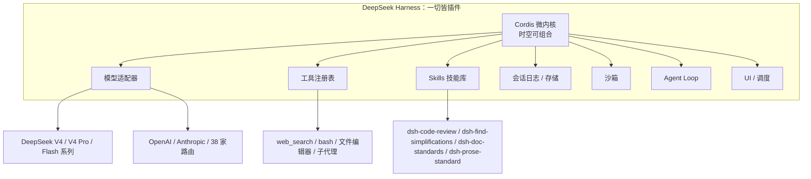
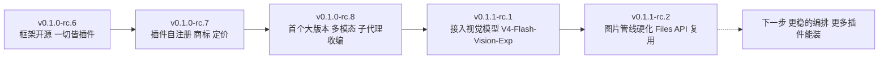

## 引言

2026年8月13日深夜，DeepSeek 没发发布会，直接把 `deepseek-ai/deepseek-harness` 以 MIT 协议扔上 GitHub。命令行工具叫 `dsh`，社区给了个昵称叫黑鲸。

热度远超一次模型发布。2小时破1万星，12小时破5万星，24小时约8.03万星，4天累计14.9万星，首周16.5万。单日星量超过 Grok-1 自2024年3月以来的历史总量。

比星量更值得看的是节奏。开源后12天连放5个版本，从 `v0.1.0-rc.6` 一路滚到 `v0.1.1-rc.2`，社区管这叫一周三更。这不像一个发完就收工的项目，更像被当成独立产品在反复迭代的执行层。

下面按版本逐个拆。每个版本我讲清楚它到底改了哪几个核心点、为什么要改，遇到和 Claude Code、Codex 能对上号的地方就顺手点一句，最后再把三家摆一起看一眼。写给已经在用或准备用 harness 写 agent 的开发者。

---

## 背景：Model + Harness = Agent 与规则制定权

2026年AI产业的主线，是从卖模型转向交付能力。模型越来越便宜也越来越密，真正稀缺的是让模型稳定干活的执行层。行业里这两年有一个被反复引用的公式：

```
Agent = Model + Harness
```

模型负责思考，Harness 负责干活：调用工具、读写文件、编排流程、管理上下文、调度子代理、审批和审计。谁控制了 Harness，谁就决定了 AI 在用户电脑上能读哪些文件、能跑哪些命令、日志塞在哪儿、要不要审批。

DeepSeek 有国内最完整的开源模型矩阵，现在把模型加外壳的整条链一并开源，成为首个在模型与工程外壳层面完整对标 Anthropic 的中国厂商，正面撞上 Claude Code、OpenAI Codex 和 GitHub Copilot。

---

## 版本速览

| 版本 | 合并入库日期 | 定位 | 链接 |
|------|------------|------|------|
| v0.1.0-rc.6 | 2026-08-13 | 开源首版，一切皆插件底座 | [仓库](https://github.com/deepseek-ai/deepseek-harness) |
| v0.1.0-rc.7 | 2026-08-17 | 插件自注册与动态面板 | [dsh-v0.1.0-rc.7](https://github.com/deepseek-ai/deepseek-harness/releases/tag/dsh-v0.1.0-rc.7) |
| v0.1.0-rc.8 | 2026-08-19 | 首个大版本，14 项更新 | [dsh-v0.1.0-rc.8](https://github.com/deepseek-ai/deepseek-harness/releases/tag/dsh-v0.1.0-rc.8) |
| v0.1.1-rc.1 | 2026-08-21 | 接入视觉模型 | [dsh-v0.1.1-rc.1](https://github.com/deepseek-ai/deepseek-harness/releases/tag/dsh-v0.1.1-rc.1) |
| v0.1.1-rc.2 | 2026-08-21 | 图片管线硬化 | [dsh-v0.1.1-rc.2](https://github.com/deepseek-ai/deepseek-harness/releases/tag/dsh-v0.1.1-rc.2) |

## v0.1.0-rc.6：一切皆插件的底座开源

第一版没做产品，做的是框架主张落地。它确立的核心不是某个功能，而是一整套插件化哲学：没有强制内核，连 Agent Loop 本身都是插件。

支撑这套哲学的是 Cordis。这是 DeepSeek 和北大合著论文里的元框架，核心叫时空可组合性。内核只负责五件事，插件、上下文、服务、事件、效果。两个维度值得展开：时间可组合性，也就是可逆效应，插件卸载时自动回滚所有副作用，热插拔不残留、不崩应用；空间可组合性，也就是反应式余效应，上下文变更会主动通知依赖它的组件。

结果是，模型、工具、技能、会话、沙箱、存储、Agent Loop、调度、UI，每一层都能独立拆换，没有需要 patch 的特权核心。这在和 Claude Code、Codex 对比时立刻显出差距：Claude Code 把内核封闭，核心循环由厂商写死，你只能在应用层用钩子在外围做拦截；Codex 根本没有内核概念，本质是提示词加本地执行器。而 dsh 是连循环本身都能整个替掉。这是三种不同的开放程度。

架构用一张图就能看明白：



四种预设模式对应四种工具集：标准模式给全量工具，文件编辑、CLI、检索、Skills、规划、子代理、工作流，日常开发用；PTC 模式做程序化工具调用，服务自动化流水线的多步编排；极简模式只给 CLI 加文件编辑器，追求低开销快跑；创造模式做环境探测加插件实验，面向写插件和调自定义预设的人。

模型路由是另一个关键。内置 38 条模型厂商路由，其中 15 家国产，含 DeepSeek、蚂蚁、月之暗面、MiniMax、Qwen、小米、智谱，再加 Anthropic、OpenAI 和自定义端点兼容。把模型做成插件、一次接 38 家，目的是绕开单一模型绑定，把选型权留给使用者。这里跟 Claude Code 是闭源绑 Claude 系列的思路完全相反，也跟 Codex 只在配置文件里填第三方的半开放不同。

生态从第一天就是设计的一部分。第一版就打了 `dsh-plugin` 这个 GitHub topic 当生态入口，因为它清楚自己的第一版能力有洞，靠别人来填。24 小时内这个 topic 下面冒出 1300 多个第三方仓库，图像理解、长期记忆、飞书接入、Token 统计、桌面客户端、多模态工作流都在往里放。生态的生长速度比框架本身更说明问题：它交付的不是一个 agent，而是一台能自己攒 agent 的机器。

## v0.1.0-rc.7：插件面板与自注册

隔四天，rc.7 是一次小而稳的迭代，但背后是一条明确的设计决策，不是顺手加功能。

它让插件支持自注册设置卡片，并优化了 Cordis 动态插件面板。这两件事是同一件事的两面：插件自己声明配置结构和 UI，不用改核心去对接每一个插件。之前插件塞进来，配置项要写进核心配置，插件作者得懂内核怎么解析配置；现在插件把自己的 schema 挂上去，界面自动渲染成设置卡片。对生态来说，这意味着插件的接入成本从需要了解内核，降到了只需要声明接口，这条门槛的降低是质变。

这套机制之所以成立，靠的还是 Cordis 的效应模型。面板本身就是插件之一，插进去和拔出来，依赖关系由内核解析，状态自动回滚。卸载一个插件，它的设置卡片自动消失，不残留配置、不污染核心。这是把"一切皆插件"贯彻到 UI 层的直接体现，插件不但能挂功能，还能挂自己的配置界面。在这一点上跟其它两家拉开得最明显：Claude Code 的扩展要过官方策划的那套清单，配置和插件由厂商筛选，而且钩子跟 agent 跑在同一进程里，改配置要改外层钩子；Codex 干脆没有这种可组合的 UI 层，工具就是出厂固定的那几样。

同一天还有两个信号，跟代码无关但比代码更说明问题。DeepSeek 注册了 DeepSeek Harness 商标，并宣布 API 峰谷差异化定价。

商标这件事，放在一个快速迭代的开源项目上格外值得琢磨。开发预览期版本号还在 0.1，框架接口随时可能变，这时候急着立品牌，说明 DeepSeek 已经把这个东西当成有商业价值的独立产品在养，而不是发个开源项目博眼球。品牌使用规范一旦立了，等同给使用者一个信号：这不是实验代码，是你要在上面长期干活的东西。

API 峰谷差异化定价则把商业化意图挑明了。把高峰期和低谷期的价格拉开，本质是引导算力错峰，把便宜的价格给到能容忍延迟的批量场景。这跟 harness 的定位天然契合，harness 面向的就是能挂机跑的大规模任务，Web 交互走峰值、batch 走谷值正好各取所需。这也解释了为什么它敢把执行层开源：真正要收钱的不只是模型调用，还有一套让模型稳定运转、能批量调度的执行系统。一个小版本背后，是框架从纯技术往收费能力加品牌资产的整体转向，这一步的份量比条目本身重。

## v0.1.0-rc.8：首个大版本的 14 项优化

这是公测后第一次成规模更新，14 项调整横跨多模态、子代理协作、终端、工具调用和开发者支持。逐点看它为什么改。

原生多模态是主角。视觉模型直接吃图，不用走降级。对没有视觉能力的模型，走一条工具链降级：OCR 文本识别、颜色占比统计、像素行扫描，加上读取尺寸和色彩模式，把结构化结果喂给文本模型再重建近似画面。这个降级链有个坦诚的边界，对 PPT 截图、流程图、UI 截图效果好，对真实照片和复杂空间场景有限。这个有限不是缺陷，是当前多模态的真实能力边界，框架做的是把它显式化。Claude 的视觉模型和内建的图像理解是一条完整流水线，Codex 则通过 View Image 工具读取，dsh 把能看图的能力做成可插的适配器，没视觉能力的模型有降级、有视觉能力的模型走原生，这种弹性反而是另两家没有的。

子代理收编是 dsh 最独特的一步。Claude Code 和 Codex 可按需以 Profile Bundle 安装为子代理，Codex 还新增非交互权限模式和多命名实例，一个任务里能跑不同名字的 Codex。实现逻辑是解析 PATH 里的二进制文件做委托执行，自己在上面做编排。把竞争对手的 agent 变成自己的执行单元，这是 meta-harness 的明证，也是 Claude Code 和 Codex 自己做不到的，它们只能派生子代理，不能把别的家的 agent 挂在名下当工具。

Windows 端 PTY 终端加了持久 PowerShell 会话，极简模式默认开启。动机是减少命令执行时反复重建终端环境的开销。这个细节很能说明开发预览期的风格，他们盯的是真实使用里最烦人的重复性成本。

Bug 修复片映射的是真实踩坑。单张超大图或历史里累积图片过多导致请求失败；流式生成取消后已展示的前缀没带进下一问或分叉会话；部分自定义 OpenAI 兼容网关因请求格式差异和推理内容缺失调用失败。这些都是下沉到生产里才会暴露的问题，逐个堵上。

开发者与性能片里，web_search 支持并发查询让多问题并行发起，子代理 reportDelivery 及时唤醒父任务，本地 dsh web 自动打开浏览器，大历史会话分叉和 SQLite 后端读写做了优化。

SQLite 这块有量化点。存储用 SQLite 加 zstd 压缩，rc.8 起跨会话历史使用多帧 zstd。代价是存储格式不向下兼容，旧数据无法自动迁移，官方标注 storage format incompatible，建议升级前备份 `$DSH_HOME`，默认在 `~/.dsh/`。升级后若历史会话消失，官方路径是降回 rc.7 手动导出再升。这是开发预览期最典型的代价，快是要付账的，对比之下 Claude 的本地 JSONL 存储格式不开放，Codex 用本地存储，都不需要用户操心迁移。

## v0.1.1-rc.1：接入视觉模型

rc.8 打通了把图送给模型的管线，rc.1 要让模型真的能看图。这一步的差别很关键：rc.8 解决的是图怎么送进请求，rc.1 解决的是送进去之后模型能不能真的理解。

DeepSeek 适配器新增 DeepSeek-V4-Flash-Vision-Exp 这个多模态选项。这里能看出模型即插件的设计有多顺：接入一个带视觉能力的新模型，就是往适配器里加一个选项，不改循环、不改工具层、不改其他模型的路由。变更被严格隔离在模型适配器这一片，这是插件化最大的工程收益。换到 Claude Code 上这是不可能的，模型和 harness 绑定死，Claude 出什么视觉能力你才能用什么；Codex 是半开放，配置里能填第三方，但模型不是一等公民，深度接入要靠社区适配器。dsh 把换模型当成换插件的正常操作，这是"模型即插件"真正兑现的地方，不是口号。

配套能力一起到位，四件事指向同一个方向，让图文混合输入成为第一等公民：

- /goal 和 /plan 命令能收图像加文本输入。这意味着你可以直接把一张架构图或报错截图塞给 agent，让它基于图去规划下一步，而不是先口述图里有什么。
- @ 菜单能引用文件与会话，把本地文件和前面的对话作为上下文拉进当前任务。
- MCP 和 ACP 支持图像附件持久化，图在协议层被当成可附着的对象，跨工具调用保留下来。
- PTC 模式支持嵌套图片转发，多步编排里图能顺着子环节传下去，不会被中间环节丢掉。

为什么这么急着补视觉？因为这是 agent 面对真实世界绕不开的能力。真实交付里大量输入是 PPT 截图、UI 稿、流程图、发票、错误堆栈图，把图转成文字再喂，信息损失和转换成本都很高。能不能直接吃图，直接决定你的工具离真实业务有多近。Claude 的视觉模型和内建图像理解是一条完整流水线，Codex 靠 View Image 工具兜底，dsh 的路径则是把视觉能力做成可插的适配器加降级链，有视觉能力的模型走原生，没有的走 OCR 加颜色统计加像素扫描。三种做法对应三种取舍，dsh 这条胜在能覆盖不同模型的差异，代价是要自己维护这一套降级逻辑，而且对真实照片和复杂空间场景的效果仍是明显短板。

## v0.1.1-rc.2：图片管线硬化

rc.1 当晚再发一版，专注把送图做稳。上一版把模型接上了，这一版要回答一个现实问题：大量图片在跑的时候，怎么让链路既不炸也不贵。

适配器优先用 Files API 上传图片，并复用已上传的文件。这是两个动作：优先走 Files API，而不是把图当普通参数塞进请求；已上传过的文件复用同一句柄，不重复传。多模态的图是贵的东西，同一张图在同一次会话里被反复引用，token 和网络都是白花。改成复用之后，图只在首次出现时上传一次，后续引用指向同一个文件实例。这对跑批量的 agent 开发者是实打实的成本优化，尤其当任务会反复看同一批截图时，去重省下来的开销是累积的。

预处理按模型需求自动缩放、转格式。不同来源的图分辨率、色彩模式、文件格式五花八门，视觉模型对输入有各自的偏好范围，直接把原图丢进去容易报错或认不出。预处理在送进模型之前把图归一成目标模型能吃的形态，把这一步对使用者藏起来。跟 rc.8 那个降级链放一起看，这条管线现在有了完整的分工：能看的模型走原生加预处理加去重，不能看的模型走 OCR 加颜色统计加像素扫描。

官方特意说明，这些改动不会把多模态能力塞给本来就没视觉能力的模型，只是让图可靠地送到支持视觉的模型手里。这句话值得单独拎出来，它是 dsh 的一个设计原则，不假装能力、不硬塞，能力边界如实呈现。很多框架为了功能好看会暗示模型能用图，dsh 选择把能做和不能做的分得清清楚楚，对使用者反而是负责任的。

对比之下，Claude 和 Codex 这一步早就趟平了，一个是成熟的图像流水线，一个靠 View Image 工具兜底。dsh 的问题是刚起步，要在同一个版本周期里把接入、读取、去重、缩放一口气补齐，而用户的硬件配置和网络环境差异很大，只能先把最影响稳定的几处压住。这个版本也预告了这条迭代的收尾方式：先打通管线，再接入模型，最后硬化稳定性，三步都不是白走的。

把五版连起来，主轴很清楚：子代理收编、多模态补齐、并发和存储优化，这几条线共同指向一个方向，把 harness 从能跑做到能扛。



---

## 和 Claude Code、Codex 简要对比

把三家放一起看，结论压缩成一句：Claude Code 和 Codex 研究的是把 harness 能力做到最好，垂直整合产品，服务当下范式；DeepSeek Harness 研究的是 harness 的可塑性，meta-harness，押注下一步的自我改进。前者卖的是稳，后者卖的是开放。

| 维度 | Claude Code | Codex | DeepSeek Harness |
|------|-------------|-------|------------------|
| 模型 | 仅限 Claude 系列，封闭 | 配置文件可填第三方，半开放 | 模型本身就是插件，原生 38 家厂商 |
| Agent Loop | 厂商写死，只能外层扩展 | 厂商写死 | 封装进 Cordis 插件，可整体替换 |
| 工具 | 15 个内置，配置控制开关 | 出厂固定，Shell、Read 等 | 全部插件化，随意插拔 |
| 记忆与会话 | 本地 JSONL，格式不开放 | 本地存储 | 记忆层也是插件，自己选位置和管理方式 |
| 运行环境 | 本地沙箱容器 | 操作系统级沙箱，三种权限 | 模块化运行层，本地、沙箱、云端可切换 |
| 安全姿态 | 应用层钩子，同进程拦截 | 内核级不可绕过沙箱，二元允许拒绝 | 四道闸门默认全关：沙箱只读、命令审批、风险存盘检查、权限升级走流程 |

各自的短板上，Claude Code 内核不开放，模型绑定订阅；Codex 可编程性受限，只有允许和拒绝写不了复杂逻辑；dsh 是开发者预览版，上手门槛高，MCP 支持面窄，只桥接 Tool，Resource 和 Prompt 的 Consumer 还没做，不建议直接上生产。

## 这一周 DeepSeek 的下半场

8月13日那一周，V4-Pro-0813 把模型开源，DeepSeek Harness 把执行层开源，API 峰谷定价开始商业化。8月17日的涨价不是简单收割，是模型单位价值让位给模型加执行层加生态的整体价值。

它交易的是规则制定权。谁让开发者习惯用它的 harness，谁就定义 AI 在用户机器上的行为规则：能不能读文件、能跑哪些命令、日志放哪、工具怎么编排、要不要审批。这套规则的争夺，比单个 agent 的市场份额重要得多。

优势组合确实特殊。MIT 加全插件加多模型兼容，当时没有第二家同时凑齐。V4-Flash 单任务约 0.2 元的成本，让大规模批量迁移第一次变得划算，Headless 模式跨 200 个文件跑迁移是它的典型场景。代价也真实，开发预览期的兼容性破坏、SQLite 格式不兼容要备份、MCP 支持面窄，这些都是快和开放换来的。

我的判断：12 天五版至少证明一件事，DeepSeek 是把 Harness 当产品在养，不是发个开源项目博眼球。接下来看三件事，插件生态能不能自己长，编排在大规模下稳不稳，MCP 完整性什么时候补上。这三样过了，这个一切皆插件的底座才算真正立起来。

---

*参考资料：DeepSeek Harness 官方仓库 deepseek-ai/deepseek-harness 与 v0.1.0-rc.8 发布说明、36氪 DeepSeek Harness 震撼开源一切皆插件、36氪 深度体验 DeepSeek Harness 我原谅它涨价了、InfoQ DeepSeek 把 Harness 开源了模型工具 Agent Loop 全是插件、阿里云开发者社区 DeepSeek Harness 当一切皆插件成为 Agent 的新底座、IT之家 对标 Claude Cowork DeepSeek Harness 公测、6wolf DeepSeek Harness 3天14.9万星、51CTO 博客 DeepSeek Harness 0.1.1-rc.2 更新、网易 DeepSeek Harness 发布 v0.1.0-rc.8 预发布版本、www.80aj.com DeepSeek Harness 首周观察 热度版本与生产风险、CSDN DeepSeek Harness 完整解读与 Claude Code Codex 的六大区别、博客园 一切皆插件 DeepSeek Harness 的架构哲学并与主流 Agent 对比。*
