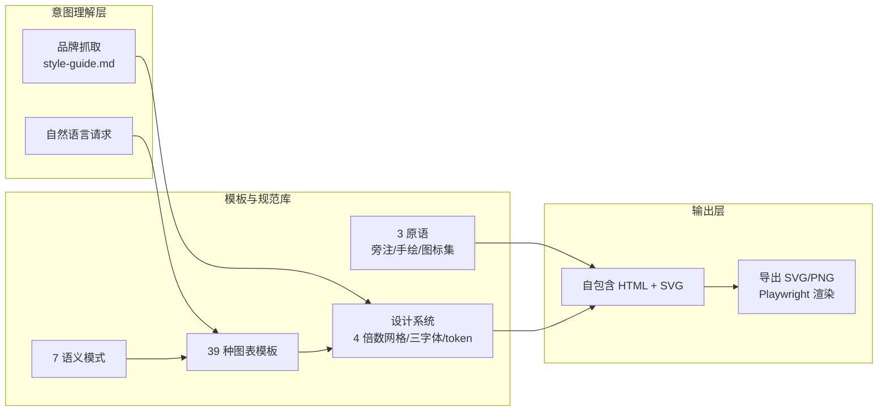

## 引言

本周 GitHub Trending 上，**cathrynlavery/diagram-design** 继续霸榜——截至 2026 年 8 月 22 日累计 **25,057 Stars**（Forks 1,528），近两周新增超过 **2 万星**。8 月 13 日单日新增一度接近 **4,500 星**，登顶 GitHub Trending 全语言榜第一；上一自然周（8/10-8/16）以 **+14,735 星的周增量**拿下 Agent 类项目周榜第一。

- 项目地址：[https://github.com/cathrynlavery/diagram-design](https://github.com/cathrynlavery/diagram-design)
- 作者：[Cathryn Lavery](https://github.com/cathrynlavery)（BestSelf.co 创始人）
- 许可证：MIT
- 技术栈：HTML + 内联 SVG（无构建、无 JS 依赖）
- 一句话定位："Editorial diagrams your designer won't hate"（设计师不会嫌弃的编辑级图表）


---

## 项目背景：AI 画图为什么一眼就能看出是 AI 画的？

### "圆角方框 + 随机间距"的模板感

作者的动机非常朴素：每次让 Claude 画图，拿回来的都是"通用圆角方框玩意，跟网站其他部分长得完全不一样"。花 30 分钟在 Figma 返工，或者干脆不放图——这是绝大多数开发者的真实选择。

为什么 AI 生成的图总有"AI 味"？多篇社区测评总结出三个根源：

- **间距随机**：AI 生成 SVG 时，坐标和间距常是 13px、17px 这样无规律的数值，缺少网格节奏
- **配色无品牌**：AI 不读你的网站，永远用默认的"蓝+灰+白"
- **语义混乱**：该强调的没强调，所有元素一视同仁

### 现有工具的局限

| 方案 | 优点 | 局限 |
|------|------|------|
| Mermaid | 文本即图、易写 | 样式固定，一眼"Mermaid 样板感"，复杂布局难 |
| draw.io | 手动可控 | 手动拖拽耗时，无法复用 |
| 手写 SVG | 完全可控 | 成本极高，坐标计算繁琐 |

diagram-design 的答案是：**模板约束 + AI 填充**——把 AI 不擅长的精确坐标、品牌配色提前固化为模板和设计 token，AI 只负责理解意图、选型、填内容。

---

## 核心创新：39 种图表类型 × 3 种视觉变体

### 多维对比

| 维度 | diagram-design | Mermaid | draw.io | 手写 SVG |
|------|---------------|---------|---------|---------|
| 图表类型 | 39 种编辑级模板 | 约 12 种基础图 | 无限制 | 无限制 |
| 视觉质量 | 编辑出版级 | 工具默认样式 | 依赖操作者 | 依赖技能 |
| 品牌适配 | ✅ 60 秒自动抓取 | ❌ | 手动 | 手动 |
| 布局稳定性 | ✅ 模板固定 | ⚠️ 自动布局飘 | ✅ | ✅ |
| 外部依赖 | 无（自包含 HTML+SVG） | 需渲染器 | 需软件 | 无 |
| 无障碍 | ✅ WCAG AA + role=img | ⚠️ 部分 | ❌ | ❌ |
| 可重绘旧图 | ✅ draw.io/Mermaid 导入 | ❌ | ✅ | ❌ |

### 四大关键创新

**1. 39 种图表类型 + 3 种视觉变体。** 从架构图、流程图、时序图、泳道图，到桑基图、鱼骨图、Wardley 地图、UML 类图、数据库 schema……覆盖架构、流程、数据、项目管理的绝大多数场景。每种图表有 **minimal light / minimal dark / full-editorial** 三种变体，从草稿讨论到正式交付全流程覆盖。

**2. 60 秒品牌适配（Brand Onboarding）。** 输入 `onboard diagram-design to https://yoursite.com`，Skill 自动抓取网站主色调与字体栈，映射为语义化设计 token（paper/ink/muted/accent/link），并自动做 WCAG AA 对比度检查。之后所有图表读取语义角色名而非硬编码颜色——改一次 `style-guide.md`，全站图表同步换肤。

**3. "除得尽 4" 设计系统。** 所有坐标、宽度、间距必须是 4 的倍数。这条规则被社区视为图不像 AI 画的关键——AI 排版怪异往往源于 13px、17px 的乱跳间距，锁死网格后整张图立刻有了节奏。配以 1px 发丝线边框、无阴影、圆角上限 10px，以及三字体分工：Instrument Serif（标题）、Geist Sans（节点名）、Geist Mono（技术标签）。

**4. 语义模式与布局解耦。** 同一图表类型可承载队列、策略追踪、信任边界等多种业务语义（fan-in 队列、安全铺装道路、补偿安全层等 7 种语义模式），避免"为每个语义造一种图"的类型爆炸。


---

## 深度架构解析：它不是"画图算法"，而是一套设计系统

diagram-design 本质不是图表生成算法，而是一套**可被 Agent 调用的模板 + 视觉规范库**。理解它的架构，要从七个设计决策入手。

### 整体架构



### 设计思想一：模板约束 + AI 填充

这是整个项目的核心假设：**LLM 不擅长像素级排版，但擅长理解意图**。

坐标计算、间距对齐、颜色搭配——这些"精确性工作"恰好是 LLM 的弱项，一旦放开自由度，就会产出 13px、17px 乱跳的间距和漂浮的元素。diagram-design 反其道而行：把排版决策**前置到模板中由人做好**，把"该选什么图、放什么内容、强调什么"留给 AI。

结果是一份明确的分工——AI 的输出空间被压缩到模板允许的范围内，自由度越低，失败模式越少，输出越稳定。这与 agent-skills、taste-skill 的"用约束换取可控性"是同一思路，也是 2026 年"Skills 工程化"浪潮的核心方法论。

### 设计思想二："除得尽 4" 的网格系统

为什么偏偏是 4？这背后有三个层面：

- **视觉节奏**：4 的倍数让所有间距落在同一个隐式网格上，类似排版中的基线网格（baseline grid）。当每个元素之间的距离都符合同一节拍，整张图立刻有了"被设计过"的感觉——这是 AI 图与设计师图最直观的差异。
- **减少自由度**：从"任意整数"收窄到"4 的倍数"，把 AI 的选择空间缩小了 75%，意味着能踩进"13px 间距"这类坑的概率大幅下降。约束本身就是一种防错机制。
- **工程友好**：4 与 8（现代设计系统的原子间距）、2（任何偶数）、以及 2× 高清屏缩放都能整除，是"除得尽"里信息量最大的一个数。

配合 1px 发丝线边框、无阴影、圆角上限 10px，这套系统把"高端设计"具象化为几条可验证的规则——这正是它能被写进提示词、让每次输出都稳定的原因。

### 设计思想三：语义 token 与品牌适配管线

品牌适配不是简单"取两个颜色"，而是一条完整管线：

```
抓取首页 → 提取配色与字体栈 → 映射为语义角色(paper/ink/muted/accent/link)
        → WCAG AA 对比度自动检查 → 写入 references/style-guide.md
```

关键在于**语义角色而非原始色值**。下游所有图表读取的是 `accent`、`ink` 这类角色名，而不是 `#FF5A00` 这样的硬编码。这带来两个收益：

1. **一次换肤，全站生效**：改 `style-guide.md` 里的一个 token，所有已生成的图表在下次重绘时同步更新，无需逐个改图。
2. **含义与外观解耦**：`accent` 表达的是"这是最该被注意的元素"这一语义，至于它是橘色还是紫色，由品牌决定。设计系统学的 separation of concerns，被直接搬进了 Agent 的提示词里。

对比度检查则是一道自动化安全网——很多 AI 生成的图配色对比度不足、在浅色显示器上几乎看不清，diagram-design 把 WCAG AA 作为硬性门槛而非可选优化。

### 设计思想四：语义模式与布局解耦

这是项目面对"类型爆炸"问题的解法。业务的语义表达几乎是无限的：队列、瓶颈、信任边界、补偿回滚、安全边界……如果为每种语义都造一种图，模板数量会失控。

diagram-design 的答案是**拆分两个维度**：

| 维度 | 是什么 | 举例 |
|------|--------|------|
| 布局模板 | 怎么画 | 架构图、泳道图、时序图的版式 |
| 语义模式 | 表达什么 | fan-in 队列/瓶颈、重复阶段槽位、配对策略追踪、安全铺装道路、治理目录、补偿安全层 |

同一张泳道图，既能画"处理队列"，也能画"安全铺装道路"——布局复用，语义注入。7 种语义模式 + 39 种布局模板的组合，覆盖了大量真实业务场景，而不必做 N×M 个独立模板。这与前端设计系统的"composition over inheritance"是同一个思想。

### 设计思想五：自包含 HTML + SVG 的工程选择

输出格式的选择极其克制：**单个自包含 HTML 文件 + 内联 SVG**。

- **零依赖**：无构建步骤、无 JavaScript、无外部图片引用。一个文件浏览器直接打开，跨环境可查看，还能放进 git 做版本管理。
- **为何选 SVG 而非 Canvas**：SVG 是 DOM 的一部分，文本可选中、可搜索、可用 CSS 定制，天然支持无障碍语义——而 Canvas 只是一块像素画布。
- **三个原语**：Annotation callout（编辑旁注）、Sketchy filter（手绘风）、Icon set（55 个单色 IT/云图标），让输出在"正式出版"与"快速手绘"之间可切换。

### 设计思想六：无障碍是默认而非可选

大多数 AI 生成图表在可访问性上是裸奔的，diagram-design 把无障碍作为默认契约：

- 内联 SVG 自带 `role="img"`、`aria-labelledby`、`<title>`/`<desc>` 槽位，屏幕阅读器可朗读图意
- ID 前缀机制避免同一页面多图冲突
- 支持 `prefers-reduced-motion`，尊重用户"减少动态效果"的系统偏好
- 可选动画四种模式（none/reveal/step/loop），默认 `none`——静态输出无需脚本

### 设计思想七：为设计系统写测试

项目最有工程师气质的一点，是它给"设计"写了测试：

- `drawio_extract.py` / `mermaid_extract.py`：解析并重绘外部源文件
- `self_check.py`、`lint-skin.py`：校验皮肤 token 完整性与合法性
- `lint-render.py`：用 headless Chromium 渲染每个模板，检查布局是否溢出、元素是否重叠
- CI 覆盖 Linux/Windows/macOS 三平台

**约束必须是可验证的**——设计系统如果不写进自动化检查，就只是"建议"。diagram-design 把"除得尽 4""无重叠""对比度达标"变成了 CI 里会失败的测试，这是它区别于大多数"提示词风格"项目的地方。


---

## 快速上手

### 安装

```bash
# Claude Code
/plugin marketplace add cathrynlavery/diagram-design
/plugin install diagram-design@diagram-design

# Codex
codex plugin marketplace add cathrynlavery/diagram-design
codex plugin add diagram-design@diagram-design

# Pi
pi install https://github.com/cathrynlavery/diagram-design
```

> 长期使用推荐 `git clone` 后软链到 `~/.claude/skills/`，避免插件缓存覆盖样式自定义。

### 品牌适配

```
你:  onboard diagram-design to https://yoursite.com
Agent: → 抓取首页 → 提取配色与字体 → 映射语义角色
       → 展示修改建议 → 写入 references/style-guide.md
```

首次使用有 first-run gate：若 `style-guide.md` 未定制，会先暂停询问——是走 onboarding、手动粘贴 token，还是先用默认样式。避免在未知品牌下盲目出图。

### 导入与导出

```bash
# 重绘旧图（draw.io / Mermaid）
/diagram-design:import-drawio platform.drawio --size=slide-16x9 --detail=simplified --audience=executive
/diagram-design:import-mermaid architecture.mmd --size=slide-16x9 --detail=simplified

# 导出 PNG / SVG
/diagram-design:export-diagram path/to/diagram.html --png-only --scale=3
```

四个调节"旋钮"——格式（html/svg/png）、尺寸（文档内嵌/16:9 幻灯片/社交卡片/A4）、细节度（faithful/balanced/simplified）、受众（engineer/mixed/executive）——让一张图能覆盖从讨论稿到发布件的全生命周期。旧图重绘（Mermaid/draw.io 导入）是常被低估的能力：历史上已存在的图可以提取内容、用新的设计语言重画，无需推倒重来。


---

## 总结：社区反响与定位

**25,057 Stars、近两周新增超 2 万、连续登顶 Agent 类 Trending**——diagram-design 的爆发，戳中的是开发者"图要拿出去给人看"的具体交付焦虑。

权威报道与社区测评一致给出了较高评价：

- [什么值得买](https://post.smzdm.com/p/ad72qqgk/)：**"一周涨 1.2 万星，Claude Code 的'画图丑'有救了"**
- [DEV Community](https://dev.to/sachincool/seven-visual-tools-one-diagram-2j4i)：在长文技术博客的内嵌图中**"以压倒性优势胜出"**，设计系统"有真实的品味"，输出达出版质量无需返工
- ClassMethod 工程师对比 Mermaid CLI 与手写 SVG 的独立评测：**视觉天花板中高、布局稳定性高、品牌定制强、零外部依赖**
- [Mr. Slash](https://slash-invest.com/diagram-design-claude-code-editorial-diagrams-2026/)：将"除得尽 4"规则解读为告别"AI 味"的关键

这不是范式突破，而是工程化精准填坑：把 AI 不擅长的排版与品牌决策提前做掉，让 AI 只做擅长的意图理解。

当然也有明确的边界：图表类型只能在 39 种模板里选，特殊表达需要改模板；简单列表、推文、前后对比这类"一段话能讲清"的内容，README 明确建议**不要画图**。部分中文测评也提醒，安装时可用 scope 限定（如 project 级），避免全局加载消耗不必要的 token。

diagram-design 是 2026 年"Skills 工程化"浪潮的又一标志——当社区从"模型能做什么"转向"工程实践如何固化为可复用技能"，把审美与规范编码进 Skill、甚至给设计系统写 CI 测试，正是这个方向最彻底的落地。

---

*本文基于 [cathrynlavery/diagram-design](https://github.com/cathrynlavery/diagram-design) 仓库 README、官方图例库及 GitHub Trending、多篇社区测评数据编写，数据截至 2026 年 8 月 22 日。*
