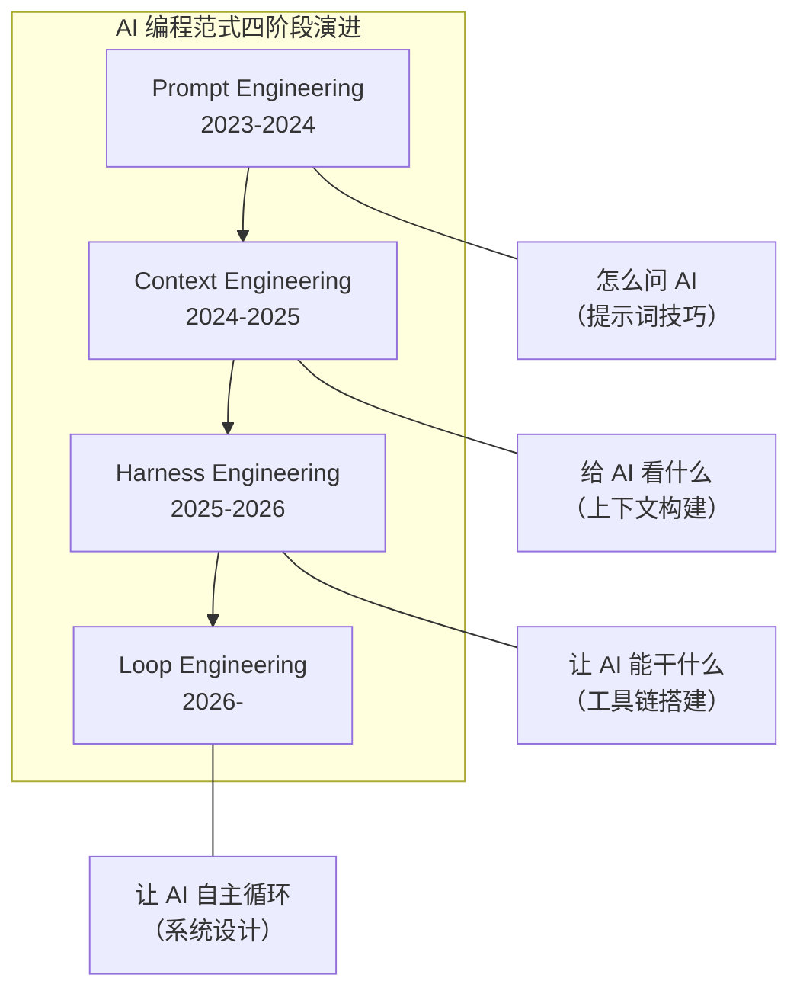
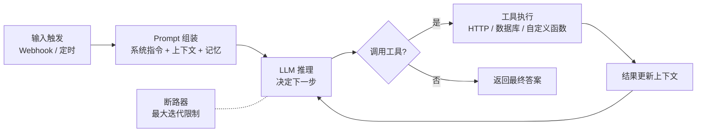
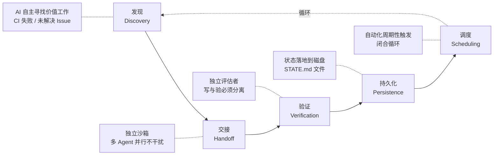

## 引言

> *"Nobody writes prompts anymore. The new job is to write and handle loops."*
> —— 黄仁勋（Jensen Huang），2026年6月

2026年6月中旬，英伟达CEO黄仁勋在接受美联社采访时的这句话，像一颗深水炸弹投进了AI圈。它被截成片段、做成海报、刷遍 X（Twitter）、引爆 Hacker News 讨论区。

紧接着，吴恩达、Andrej Karpathy、Addy Osmani、Boris Cherny（Claude Code之父）等一众硅谷大佬纷纷站台。OpenAI 在同周发布了 Codex **Record and Replay** 功能——"做一次给 AI 看，从此不用写 Prompt"。与此同时，ClickUp CEO 宣布裁掉 22% 的员工，代之以 3,000 个 AI Agent，"AI 精神病"一词由此诞生。

一周之内，Promises 和 Panic 交织在一起。本文试图还原 2026 年 6 月 13-19 日这一周里，AI 编程领域正在发生的范式级变化，以及那些容易被欢呼声淹没的隐忧。

---

## 什么是 Loop Engineering？

### 从 Prompt 到 Loop：四次范式跃迁

要理解为什么"Loop"让整个硅谷疯狂，需要先看清 AI 编程在过去三年经历的四个阶段：

- **Prompt Engineering 时代**（2023-2024）：核心是"怎么问"。人们研究 Chain-of-Thought、few-shot、角色设定，把写 Prompt 当成一门玄学手艺。
- **Context Engineering 时代**（2024-2025）：核心是"给 AI 看什么"。RAG、MCP 协议、知识图谱兴起，焦点从提问技巧转向上下文构建。
- **Harness/Toolchain Engineering 时代**（2025-2026）：核心是"让 AI 能干什么"。Skills、MCP Server、沙箱、工具链爆发，Agent 从对话变成执行系统。
- **Loop Engineering 时代**（2026-）：核心是"让 AI 自主循环运转"。人的角色从"执行者"变为"规则设计者"——不再一步一步指挥 AI，而是设计一套系统，让 AI 在其中自主发现任务、执行、验证、迭代。

"Loop Engineering"这个术语由 Google Chrome 工程师 **Addy Osmani** 在 **2026年6月7日** 的博文中正式命名。一周之内，它成为整个 AI 圈讨论度最高的话题。

### Prompt 模式 vs Loop 模式

| 维度 | Prompt 模式 | Loop 模式 |
|------|------------|----------|
| **人扮演的角色** | 执行者/传话人 | 规则设计者/算力分配师 |
| **工作方式** | 写 Prompt → 得结果 → 再写 Prompt | 设目标 → 系统自主循环 → 人必要时介入 |
| **运行时间** | 仅限人坐在电脑前 | 24/7 持续运转 |
| **瓶颈** | 人的注意力和决策带宽 | Token 预算和验证质量 |
| **出错后果** | 单个输出有误，人及时发现 | 错误可能积累入库，发现时已晚 |
| **适用任务** | 一次性、探索性任务 | 重复性、有明确验收标准的工作 |

---

## 硅谷大佬集体站台

那周最引人注目的不是某一家公司的产品发布，而是整个行业领袖的**集体表态**：

| 人物 | 言论 | 冲击力 |
|------|------|--------|
| **黄仁勋**（NVIDIA CEO） | "没人再写提示词了，新时代的工作是编写和管理循环。" | 🔥🔥🔥🔥🔥 |
| **吴恩达**（AI 领袖） | "3-6 个月内，所有人都会使用自改进循环。Prompt 必死。" | 🔥🔥🔥🔥🔥 |
| **Boris Cherny**（Claude Code 之父） | "我已经彻底卸载了 IDE。几百个小 Agent 同时在跑，所有代码在手机上完成。" | 🔥🔥🔥🔥 |
| **Addy Osmani**（Google Chrome） | 正式命名"Loop Engineering"并定义了五步框架 | 🔥🔥🔥🔥 |
| **Andrej Karpathy**（前 Tesla AI） | "你可以外包你的思考，但你无法外包你的理解。" | 🔥🔥🔥🔥 |
| **Peter Steinberger**（OpenClaw 之父） | "每月一提醒：别再手写提示词了——设计循环才是正事。" | 🔥🔥🔥🔥 |

> 据 Anthropic 内部工程师透露，Anthropic 超过 80% 的工程师已经在使用自改进循环，预计 3-6 个月内将达到 100%。

## 产品落地：你用的工具已经在"Loop"了

### OpenAI Codex：Record and Replay

2026年6月18日，OpenAI 发布了 Codex 的 **Record and Replay** 功能。它不是一个新的 Prompt 技巧，而是彻底绕过了 Prompt：

> 你在 Mac 上**做一遍**某个操作（如填一张报销单），Codex 在旁边"看着"你完成所有步骤。然后它自动生成一个 **SKILL.md** 文件——一份人类可读的、可编辑的说明文档。下次只需要告诉它"再做一遍"，参数换一下，Codex 就会自动重放整个流程。

这意味着：对于重复性工作，你再也不需要写 Prompt 了。做一次，让 AI 学会，然后放手。

### Claude Code：内置循环指令

Anthropic 的 Claude Code 在这一波中走得更远——它已经完全内置了循环原语：

- **`/loop`** — 定时循环：让 Agent 每隔一段时间自动执行任务
- **`/goal`** — 目标驱动：设定目标，Agent 自主规划并执行
- **`/schedule`** — 云端定时任务：Agent 在后台持续运行

最关键的设计决策是：**写代码的大模型和验收的小模型分离**——Claude Opus 负责写代码，Claude Haiku 负责验证，两者独立运行，验收者看不到写代码者的推理过程。

### 一个真实对比

有人在 Hacker News 上分享了一个实验：用传统的 Prompt 方式构建一个复古小游戏 App，耗时 20 分钟，花费 $9；改用 Loop 方式构建同一个应用，耗时 6 小时，花费 $200。**但** Loop 产出的质量明显更高、代码更健壮、覆盖了更多边界情况。

这引出了一个关键问题：Loop 不是免费的。它用 **Token 开销** 换取了 **质量提升**。当你的 Token 成本足够低、验证足够自动化时，Loop 才真正划算。

---

## 开源工具落地：当 Loop Engineering 遇到 n8n

理论说完了，那现实中有没有开源工具能让开发者真正"Loop 起来"？答案是 **n8n**——这个拥有 60,000+ GitHub Stars 的开源工作流引擎，在 2026 年已经演变为 Loop Engineering 最重要的实践平台之一。

### n8n AI Agent 节点：循环即架构

n8n 的 AI Agent 节点天然实现了 Loop 的核心模型——它不是传统的"输入→处理→输出"的确定性节点，而是一个**循环执行引擎**：

每个循环中，Agent 经历：**推理 → 决定调用工具 → 执行工具 → 更新上下文 → 再次推理**，直到任务完成或被断路器终止。

n8n 社区围绕这一循环生态，生长出了一系列关键工具：

| 工具/项目 | 定位 | 与 Loop 的关系 |
|----------|------|---------------|
| **n8n AI Agent 节点** | 内置循环执行引擎 | 实现了 Loop 的核心"推理→行动→观察"闭环 |
| **n8n-goal-loop** | 九要素 Goal 生成器 | 将工作流需求转为驱动 Agent 的完整开发测试闭环 |
| **n8n-nodes-claude-code-agent-loop** | Claude Code 原生集成 | 在 n8n 内直接运行 Claude Code Agent，支持多仓库 |
| **n8n-MCP Server** | 官方 MCP 协议支持 | AI Agent 可实时查询 1,084 个节点文档和 2,709 个工作流模板 |
| **n8n AI Builder** | 自然语言生成工作流 | 8 个专家技能 + MCP 集成，让 Agent 自主生成、校验、修复工作流 |
| **Human-in-the-Loop 节点** | 人工介入暂停/恢复 | 提供签名审批链接，支持邮件/Telegram/WhatsApp 多渠道 |

### n8n-goal-loop：把"写需求"变成"设目标"

这个社区项目是 Loop 哲学最鲜明的体现。它将一个 n8n 工作流的构建需求转化为 **9 个要素**的 Goal，然后驱动 Agent 进入"构建 → 验证 → 部署 → 测试 → 迭代"的闭环：

| # | 要素 | 说明 |
|---|------|------|
| 1 | **Outcome** | 要构建什么工作流（节点链 + 交付物） |
| 2 | **数据流契约** | 节点间的字段映射——最大的 Bug 来源 |
| 3 | **错误处理** | continueOnFail、降级存储、优雅降级 |
| 4 | **验证** | 分层测试：脚本验证 + 端到端验证 |
| 5 | **约束** | 红线规则（不硬编码密钥、不在 Code 节点发 HTTP） |
| 6 | **边界** | 只修改目标工作流，不触及凭证和其他工作流 |
| 7 | **迭代策略** | 小样本先行、PUT 后刷新缓存、最多 3 轮 |
| 8 | **完成条件** | 端到端测试通过 + 真实业务字段值正确 |
| 9 | **暂停条件** | 何时需要人工介入（真实凭证、支付、实例异常） |

这套框架的精妙之处在于：它把"人写 Prompt 告诉 AI 做什么"变成了"人设定目标和边界，让 AI 自己规划并执行"——这正是 Loop Engineering 的核心主张。

### Guarded Agentic：生产级的防御闭环

在 GÉANT 的 2026 年 SIG-AI 工作中，出现了一种更严谨的模式——**Guarded Agentic Workflows**。在 Agent 的每次循环中插入确定性的守卫节点：

| 层 | 时机 | 作用 |
|----|------|------|
| **Normalise** | 每个 Agent 之后 | 确定性节点规范化 Agent 输出 |
| **Validate** | 每个 Agent 之后 | 结构化解析器检查输出是否符合声明契约 |
| **Guard** | 每个行动之前 | 评估该行动在当前状态下是否合法 |
| **Verify** | 每次写入之后 | 独立重新查询数据源，失败自动回滚 |

这套"防御闭环"解决了 Loop 最核心的信任问题：**写和验必须分离**，而且每次循环都要经过多层守卫，而不是让 Agent 自己给自己打分。

### 启示

n8n 生态的爆发揭示了一个事实：**Loop Engineering 不是一个抽象概念，而是一套正在被开源社区 concretely 实现的架构模式。** 从 n8n AI Agent 节点的循环引擎，到 n8n-goal-loop 的 Goal 驱动开发，再到 Guarded Agentic 的分层守卫——每一层都在把"让 AI 自主循环"这件事变得更可靠、更可审计、更可控制。

如果你想让自己的第一个 Loop 落地，从 n8n 开始可能是最务实的选择。

---

## 阴影面：AI 精神病与信任危机

就在硅谷为"Loop"欢呼的同时，另一条新闻也在发酵：

### ClickUp 裁掉 22% 的员工

2026年5-6月，项目管理平台 ClickUp 的 CEO Zeb Evans 宣布 **裁掉 22% 的员工**，同时部署了约 **3,000 个内部 AI Agent**，人与 Agent 的比例达到 1:3。剩余的员工被重新划分为"构建者"、"系统管理者"和"一线人员"三类。公司甚至推出了**百万美元年薪**的薪酬区间——前提是你能产生"100 倍的影响"。

Hacker News 上对此的讨论充满愤怒和嘲讽。有人指出：ClickUp 的真实动机可能不是效率革命，而是**用 AI 叙事掩盖增长放缓**——当你的产品是"项目管理工具"却裁掉自己的项目经理时，这更像是一场营销表演而非技术突破。

### "AI 精神病"

Box 创始人 **Aaron Levie** 在同期提出了一个迅速走红的概念：**"AI Psychosis"（AI 精神病）**。他描述了一种现象：

> 科技 CEO 们长期只看高层级的产品演示，远离实际开发一线，逐渐产生了"AI 无所不能"的幻觉。他们看到 AI 能写一段代码，就认为 AI 能替代整个工程团队；看到 AI 能生成一个页面，就认为产品团队可以砍掉一半。这种"幻觉"正在成为大规模裁员的借口。

数据显示这并非危言耸听：2026年前五个月，已有 **115,000+ 名科技从业者被裁**（几乎与 2025 年全年持平），"AI"被列为首要原因。

更值得深思的是实证研究：**UC Berkeley、NBER 和 MIT 的研究均未发现当前 AI 采纳率与整体生产力增长之间存在稳健关联**。MIT 甚至预测，AI 达到文本任务的基准能力可能要等到 2029 年。

### 理解债务（Comprehension Decay）

Boris Cherny 在采访中坦率地承认了一个被很多人忽视的问题——**理解债务**：

> "Agent 写代码的速度越来越快，但开发人员对代码库本身的理解却在变浅。代码不再是你写的，而是 Agent 生成的。有一天你打开仓库，发现自己已经看不懂里面到底在干什么了。"

他把这称为"理解债务"——类似于技术债务，但更隐蔽：**代码还在，但理解代码的人不在了。** 当 Loop 里跑着的 Agent 越来越复杂，人类逐渐退到"只管审批"的位置，整个系统的可理解性在悄然流失。

Andrej Karpathy 的警告与此呼应：

> "你可以外包你的思考，但你没法外包你的理解。"

---

## Loop 的五步框架：怎么真正"Loop 起来"

在一片喧嚣中，Addy Osmani 和社区贡献者总结了构建一个可靠 Loop 的五个关键环节：

### 1. 发现（Discovery）
AI 利用技能库自主寻找有价值的工作：读取 CI 失败记录、扫描未解决的 Issue、监控异常日志。不再是"人告诉 AI 做什么"，而是 AI **自己找到该做什么**。

### 2. 交接（Handoff）
每个任务开启独立沙盒，多个 Agent 并行运行互不干扰。这是 Claude Code 的 `/goal` 和 Codex 的多子 Agent 系统的核心逻辑。

### 3. 验证（Verification）
**这是最核心、也最容易被忽视的一步。** 写代码的 Agent 和验收的 Agent 必须分离——不能用同一个模型既写又验。关键在于：**验收者不应该看到写代码者的推理过程**，以避免确认偏误。

### 4. 持久化（Persistence）
将状态和进度固化到磁盘（如 STATE.md 文件）。Agent 的"记忆"不应该只存在于上下文窗口中——断线后重启，Loop 应该从中断处继续，而不是从头再来。

### 5. 调度（Scheduling）
通过自动化脚本让系统周期性自主运转。Claude Code 的 `/loop` 和 `/schedule` 就是这层的实现。

> **冷启动建议**：在投入复杂 Loop 之前，先做"四条件测试"——任务重复发生吗？有自动化验收手段吗？Token 预算扛得住吗？Agent 有高级工具吗？四个全过才值得建 Loop。

---

## 总结：人的判断力是最后的稀缺资源

2026 年 6 月中旬这一周，AI 编程走到了一个分水岭。

一方面，"Prompt → Loop"的范式迁移真实发生着。它不是炒作——你的工具已经在变（Claude Code 的 `/loop`、OpenAI 的 Record and Replay），你身边的同事已经在用（Anthropic 80% 工程师的采纳率），你崇拜的大佬已经在喊你跟上。

另一方面，这一波的隐忧远比以往更深。理解债务在积累，AI 精神病在蔓延，生产力神话尚未被数据证实。当 ClickUp 用 3,000 个 Agent 替换 22% 的员工时——技术没问题，但动机和后果值得追问。

或许这一周留给我们的最清醒的声音来自 Karpathy：

> 代码生成几乎免费了。**判断力**成了唯一的稀缺资源。

你今天在 AI 编程上的核心竞争力，不是"会写 Prompt"（那确实在贬值），也不是"会用 Loop"（那很快会成为标配），而是 **判断力**——知道什么时候该信任 AI 的输出、什么时候该人工介入、什么时候根本不该用 Loop。

这才是任何范式迁移中，唯一不可外包的能力。

---

*参考资料：Jensen Huang AP 采访、Addy Osmani "Loop Engineering" 博文、OpenAI Codex Record and Replay 发布公告、Anthropic Claude Code 更新日志、TechCrunch "AI Psychosis" 报道、The Next Web ClickUp 报道、UC Berkeley / NBER / MIT 生产力研究、Hacker News 相关讨论。*
