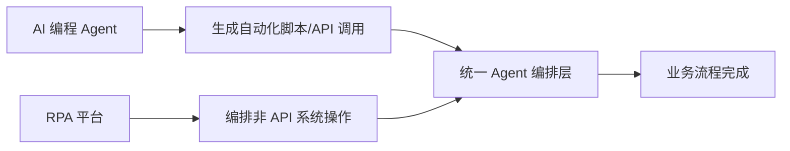

## 引言

2026 年的自动化市场正经历一场结构性变革。

一方面，以 **Claude Code**、**OpenAI Codex**、**Cursor** 为代表的 AI 编程智能体（Coding Agent）正在重新定义软件开发——它们能自主理解需求、编写代码、修复 Bug、甚至管理整个 CI/CD 流水线。在开发者社区，"Agent 替代人工"已不再是一句口号。

另一方面，传统的 **RPA（Robotic Process Automation）** 市场正在经历一场"自我革命"。UiPath、Automation Anywhere、Blue Prism 等老牌厂商纷纷摘下"RPA"的帽子，转而拥抱 Agent 架构。它们不再说"我用机器人模拟你的鼠标点击"，而是说"我用 AI 智能体自主完成你的业务流程"。

这场变革背后的问题是：**当 AI 编程 Agent 都能写代码了，RPA 还有存在的必要吗？**

答案是肯定的——但 RPA 的形态已经彻底改变了。本文将从国际阵营、国产阵营、AI 编程工具三个维度，为你梳理 2026 年 RPA 市场的全景图与选型逻辑。

---

## 行业变局：RPA 增速放缓，Agent 市场爆发

先看两组关键数据：

| 指标 | 2025 年 | 2026 年（预估） | 增长率 |
|------|---------|----------------|--------|
| 全球 RPA 市场规模 | ~$36 亿 | ~$41 亿 | ~14% |
| 全球 AI Agent 市场规模 | ~$76 亿 | ~$109 亿 | >45% |
| 企业自动化预算转向 Agent | — | 60%+ 新项目首选 Agent 架构 | — |

RPA 市场仍在增长，但增速远不及 AI Agent。更关键的是，**所有主流 RPA 厂商都在主动"去 RPA 化"**：

- **UiPath** 推出了 Agent Builder 和 Maestro 编排平台
- **Automation Anywhere** 收购了 AI 公司 Aisera
- **Blue Prism** 围绕"自主智能体"重塑品牌
- **Microsoft** 将 Power Automate 深度融入 Azure AI Foundry

传统 RPA 能自动化的流程约占企业总流程的 20-30%，而引入 Agent 能力后，这一比例有望提升至 60-80%。这是整个行业转型的根本驱动力。

---

## 国际阵营：三巨头的 Agent 化转型

### 1. UiPath — 生态之王

**核心定位**：企业级超自动化平台 + Agent Builder

UiPath 是 RPA 领域毫无争议的第一品牌，福布斯 500 强中超过 60% 是其客户。但在 2026 年，UiPath 的市场份额正被新兴 Agent 平台蚕食，从巅峰期的 25%+ 下降至约 19.5%。

**AI/Agent 能力**：
- **Agent Builder**：低代码构建 AI Agent，集成多 LLM（GPT、Claude、Gemini）
- **Maestro**：Agent 编排层，管理多个 Agent 的协作与调度
- **ScreenPlay**：基于视觉的 UI 理解，让 Agent 能"看懂"桌面应用
- **AI Fabric**：统一 AI 模型管理、部署与监控

**优势**：生态最强（超 100 万开发者）、社区最大、文档理解（Document Understanding）能力领先
**短板**：授权成本极高（年费约 ¥85-160 万/20 机器人）、复杂度大、部署周期长
**最佳场景**：大型企业全栈自动化，尤其是需要与遗留桌面系统打交道的场景

### 2. Automation Anywhere — AI 先行者

**核心定位**：云原生自动化 + 认知 AI

Automation Anywhere（AA）是三者中最"激进"向 AI 转型的厂商。2025 年收购 Aisera 后，其 AI Agent 能力显著增强。

**AI/Agent 能力**：
- **AI Agent Studio**：可视化构建认知 Agent
- **Process Reasoning Engine**：流程推理引擎，理解业务流程而非固定脚本
- **自动化副驾（Automation Copilot）**：用自然语言创建和触发自动化

**优势**：云原生 SaaS 架构、AI 驱动自动化、智能文档处理能力强
**短板**：高级功能需额外付费、复杂部署依赖专业服务、价格偏高（$500-1,000/机器人/月）
**最佳场景**：追求 AI 深度集成、云优先策略的企业

### 3. Blue Prism（SS&C Blue Prism）— 合规首选

**核心定位**：安全合规型企业 RPA

Blue Prism 被 SS&C 收购后，继续保持其在合规、治理方面的极致追求，是金融和医疗行业的首选。

**AI/Agent 能力**：起步较晚，但正在围绕自主智能体重塑产品线，推出 Decipher IDP（智能文档处理）和 Blue Prism Agent Framework。

**优势**：治理与合规能力顶尖（SOC 2、ISO 27001、完整审计追踪）、稳定性评分最高（7.4/10）
**短板**：AI 能力相对落后、云原生较弱、价格昂贵（定制报价）
**最佳场景**：银行、保险、政府等强监管行业

**三巨头核心对比**：

| 维度 | UiPath | Automation Anywhere | Blue Prism |
|------|--------|-------------------|------------|
| 2026 市场份额 | ~19.5% | ~15.3% | ~11.1% |
| Agent 能力 | Agent Builder + Maestro | AI Agent Studio | Agent Framework（起步中） |
| 稳定性评分 | 7.3/10 | 7.0/10 | 7.4/10 |
| 年费（20 机器人） | ¥85-160 万 | 中高档 | 定制报价 |
| 生态规模 | 100 万+ 开发者 | 中等 | 较小 |
| AI 成熟度 | ⭐⭐⭐⭐ | ⭐⭐⭐⭐⭐ | ⭐⭐⭐ |

### Microsoft Power Automate — 生态绑定的最佳选择

虽然不算传统 RPA 三巨头，但 Microsoft Power Automate 凭借与 Azure/M365 的深度绑定，已成为 2026 年最具性价比的自动化平台之一。定价仅 $15-40/用户/月，且深度集成了 Azure AI Foundry 的 Agent 能力。如果你的企业已经生活在微软生态中，它几乎是不用思考的选择。

---

## 国产阵营：影刀、来也、弘玑的差异化路线

国内市场呈现出与全球市场截然不同的格局。国产 RPA 厂商通过低价、本地化服务和信创合规，正在快速占领中小企业市场。

### 1. 影刀 — 全民 RPA 的推动者

**核心定位**：AI 驱动的轻量级 RPA 平台

影刀是国产 RPA 中知名度最高的品牌之一，以电商场景起家，目前在电商领域的市占率超过 55%。

**差异化策略**：
- **个人免费**：大力推广个人用户，培养"全民 RPA"生态
- **极致易用**：拖拽式操作，业务人员 1-2 周即可上手
- **自然语言驱动**：魔法指令 3.0 让用户用中文描述需求，AI 自动生成流程

**AI Agent 进展**：集成了 AI 辅助流程设计，但 AI 能力仍依赖外部大模型，自主任务规划能力有限。AI 与 RPA 的结合深度尚浅。

**适用场景**：电商运营（SEO 标题优化、竞品监控、自动上架）、中小企业内部自动化
**价格**：专业版约 ¥3,000-5,000/年/机器人，企业版约 ¥8,000-15,000/年/机器人

**一句话评价**：入门门槛最低，适合想"先跑起来"的团队。

### 2. 来也科技 — 行业深度的 AI+RPA 方案

**核心定位**：RPA + AI 全栈解决方案

来也科技的产品矩阵由三部分组成：
- **UiBot**：RPA 自动化平台
- **吾来**：对话机器人平台
- **UiBot Mage**：AI 能力平台（OCR、NLP、智能文档处理）

**差异化策略**：深耕高门槛行业。在金融、政务领域累积了大量标杆客户，尤其在智能文档处理（保单识别、合同审核、学历验证）方面积累深厚。

**AI Agent 进展**：推出"数字员工"产品线，将 OCR、NLP、RPA、Agent 打包为一体化解决方案，支持国产化与私有化部署，满足信创合规要求。

**适用场景**：政务审批、金融行业（合同审核、学历验证）、保险单据处理
**价格**：中高价位，AI 模块可能额外收费

**一句话评价**：如果你在金融或政务行业，来也是信创合规下的安全牌。

### 3. 弘玑 Cyclone — 大型企业的超自动化平台

**核心定位**：超自动化（Hyperautomation）平台

弘玑是唯一入选 Gartner RPA 魔力象限的中国厂商，产品具备全球化基因，支持多语言、多时区处理。

**差异化策略**：走"大企业、大平台"路线。将流程挖掘、RPA、AI 整合为端到端平台，服务中石化、国家电网、比亚迪等大型标杆客户。

**AI Agent 进展**：强调端到端流程智能——从流程设计、运行、管理到 AI 赋能的全链路打通。在比亚迪项目中，通过整合 MES、ERP、WMS 等多套异构系统，将生产排产效率提升 40%。

**适用场景**：大型企业数字化转型、制造业/能源/央企的复杂流程自动化、跨国业务
**价格**：较高，需定制报价

**一句话评价**：如果你在大型国企或跨国企业，弘玑的平台化架构更适合复杂需求。

**国产三强对比**：

| 维度 | 影刀 | 来也科技 | 弘玑 Cyclone |
|------|------|---------|-------------|
| 核心优势 | 易用 + 低价 | 行业深度 + 信创 | 平台化 + 全球化 |
| AI Agent 能力 | ⭐⭐（外部依赖） | ⭐⭐⭐⭐（深度集成） | ⭐⭐⭐（端到端） |
| 上手门槛 | 极低 | 较高 | 高 |
| 适用企业规模 | 中小 | 中大型 | 大型/超大型 |
| 主打行业 | 电商/零售 | 金融/政务 | 制造/能源/央企 |
| 价格区间 | 低 | 中 | 高 |

---

## AI 编程 Agent vs RPA：竞争还是互补？

2026 年，Claude Code、OpenAI Codex、Cursor 等 AI 编程工具的能力已经强大到让人不禁发问：**它们会取代 RPA 吗？**

答案是：**不会完全取代，但会重塑 RPA 的边界。**

### 核心差异

| 维度 | AI 编程 Agent（Claude Code/Codex/Cursor） | RPA 平台（UiPath/影刀等） |
|------|------------------------------------------|-------------------------|
| 操作对象 | 代码、终端、文件系统 | 桌面应用、Web 页面、企业系统 |
| 用户群体 | 开发者/工程师 | 业务人员/平民开发者 |
| 核心能力 | 写代码、重构、调试 | 模拟人工操作、数据搬运、流程编排 |
| 自动化形态 | 直接生成代码/脚本 | 录制回放 / 拖拽流程图 |
| 人机交互 | CLI / IDE 插件 | 可视化设计器 / 流程图 |
| 治理与合规 | 弱（面向开发） | 强（审计追踪、角色权限、版本管理） |

### 谁在蚕食谁？

AI 编程 Agent 正在吃掉 RPA 市场的"技术端"：

- 以前需要 UiPath 自动化一个 ERP 操作，现在开发者可以让 Claude Code 直接写一个 Python 脚本来调用 ERP 的 API
- 以前需要拖拽流程图实现的审批流程，现在 Codex 可以直接生成一个 Airflow DAG

但 RPA 的护城河在于**非技术用户**和**遗留系统**：

- 业务人员不会写 Python 脚本，但他们能理解拖拽流程图
- 很多老旧企业系统没有 API，只能通过 UI 自动化操作
- RPA 平台提供的治理、审计、合规能力，是裸脚本无法替代的

### 实际趋势：融合而非替代

最好的实践是组合使用：

例如，一个订单处理流程可以是：Claude Code 生成调用 CRM API 的 Python 脚本 → 脚本将数据写入中间表 → 影刀 RPA 从中间表读取数据并填入老旧的 ERP 桌面客户端。**AI Agent 做"大脑"，RPA 做"手脚"**。

---

## 选型决策指南

没有最好的 RPA，只有最适合的 RPA。以下是 2026 年的分场景推荐：

| 你的情况 | 推荐平台 | 核心理由 |
|---------|---------|---------|
| 已在微软生态中 | Power Automate | 最低集成成本，透明定价 |
| 全球大型企业，追求功能完整 | UiPath | 生态最强、社区最大 |
| 重视 AI 深度集成，云优先 | Automation Anywhere | 认知能力 + 云原生架构 |
| 金融/政务/强合规行业 | Blue Prism / 来也科技 | 审计追踪与信创合规 |
| 国内中小企业，电商场景 | 影刀 | 低价、易用、电商生态好 |
| 大型国企/制造业主 | 弘玑 Cyclone | 平台化架构，端到端服务 |
| 你是开发团队，仅需简单自动化 | Python + Claude Code | 零成本、灵活、可定制 |
| 想要尝试 AI Agent 原生平台 | Crew AI / n8n / Dify.ai | 纯 Agent 架构，无遗留包袱 |

---

## 总结

2026 年，RPA 市场的关键词不是"竞争"而是"融合"。

传统 RPA 厂商正在拥抱 AI Agent——UiPath 推 Agent Builder，AA 收购 Aisera，影刀的魔法指令用自然语言驱动流程。与此同时，Claude Code、Codex 等 AI 编程工具正在模糊"写代码"和"做自动化"之间的界限。

对企业的启示是：**不要纠结于"选 RPA 还是 Agent"，而是思考"哪些流程需要确定性执行，哪些需要智能决策"**。前者交给 RPA，后者交给 Agent，而两者之间的桥梁，正在被 2026 年的技术浪潮悄然铺就。

> 工具没有绝对好坏，只有是否适合。建议在做出最终决策前，用 2-4 周做一个 POC（概念验证），让候选平台在你的真实业务场景中跑一遍——这是最有说服力的选型方式。
