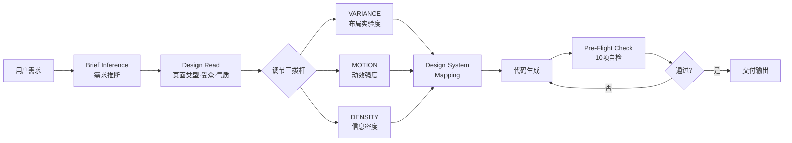
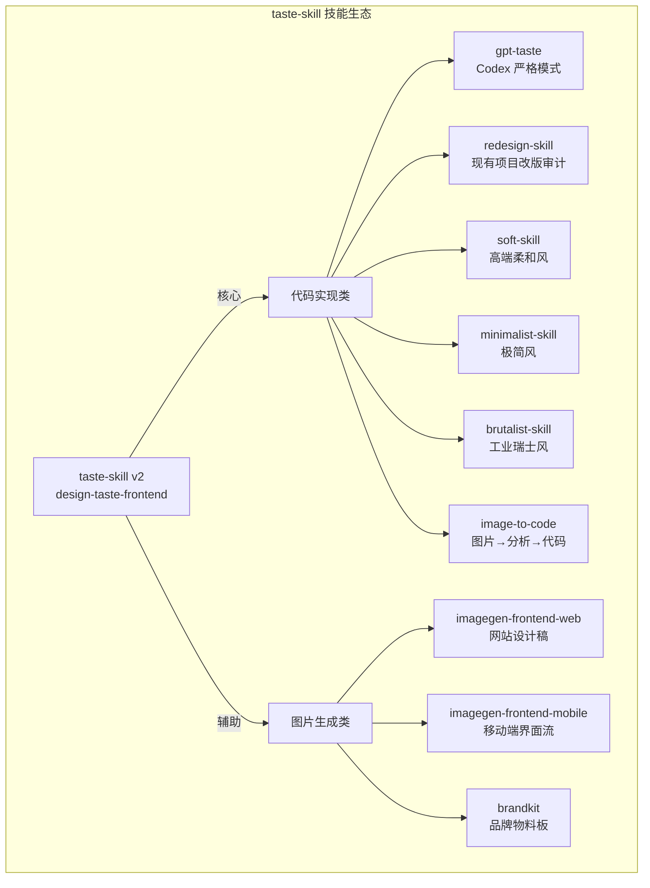

## 引言

2026 年 6 月中旬的 GitHub Trending 榜单上，AI Agent 生态继续主导热门趋势。在众多 Agent 仓库中，**Leonxlnx/taste-skill** 以 **+8,700 Stars** 的周增量脱颖而出，在 Agent 类项目中位列前三，截至 6 月中旬总量突破 **43,000 Stars**。这是一个定位于 **"The Anti-Slop Frontend Framework for AI Agents"** 的开源项目——它不是又一个组件库，而是一套可移植的 Agent Skill 文件（`.SKILL.md`），专门修正 AI 编码工具生成前端时的设计品味问题。

项目地址：[https://github.com/Leonxlnx/taste-skill](https://github.com/Leonxlnx/taste-skill)  
官方站点：[https://tasteskill.dev](https://tasteskill.dev)  
许可证：MIT  
主要技术：JavaScript / Shell / Markdown（SKILL.md）  
赞助商：Vercel OSS Program

---

## 项目背景：AI 前端的"廉价感"危机

### 看得见的"差点意思"

如果你用过 Claude Code、Codex 或 Cursor 生成前端页面，大概率见过这样的输出：

- 深色背景 + **紫蓝渐变**大 Hero
- 三张**等宽功能卡片**一字排开
- 居中大标题加一段 20 字以内的副文本
- 页面底部三列 **"假数据"**——4.8x 性能提升、99.99% 准确率、12,000+ 团队信赖

代码没有错，但页面"差点意思"。这种 AI 生成界面的**视觉趋同现象**在社区中被称为 **"AI Slop"**（AI 廉价感）。它不是单个模型的问题，而是当前 AI 编程工具的共同短板：

| 问题 | 表现 | 根因 |
|------|------|------|
| **视觉同质化** | 所有 AI 生成的页面长一个样 | 训练数据中的高频模式被过度强化 |
| **假数据泛滥** | 无来源的夸张数字、假产品截图 | AI 没有"真实"的概念边界 |
| **布局缺乏节奏** | 反复出现居中·三列·卡片的单调排列 | 缺乏对视觉节奏和留白的理解 |
| **动效生硬** | 仅有 hover 变色或生硬的淡入 | 对动效设计原则缺乏认知 |

### 现有方案的盲区

此前社区已有一些尝试来改善 AI 输出质量——更好的 Prompt 模板、更详细的系统指令。但这些方案都存在一个根本问题：**每次都要从零写 Prompt，不可复用、不可版本化、不可共享。**

taste-skill 的出现，正是在这个节点上：它将设计经验和反模式规则打包为**可版本管理、一键安装、跨 Agent 共享**的 SKILL.md 模块，让"审美"从玄学变成工程。

---

## 核心创新：把"品味"量化成可调旋钮

taste-skill 的核心创新不在于写更多代码，而在于**重新定义 AI 生成代码前的决策流程**。v2 版本引入了四大机制：

| 机制 | 说明 | 解决的问题 |
|------|------|-----------|
| **Brief Inference（需求推断）** | 生成代码前先输出 Design Read，判断页面类型、受众、风格关键词 | 阻止 AI 直接跳到默认审美 |
| **三拨杆调节（Three Dials）** | VARIANCE / MOTION / DENSITY 三个 1-10 旋钮 | 将模糊的"设计感"量化 |
| **Design System Map** | 根据 Brief 自动匹配设计系统（Fluent / M3 / shadcn 等） | 确保风格上下文匹配 |
| **Anti-Slop 规则引擎** | 硬编码反模式黑名单 + 10 条 Pre-Flight 自检 | 拦截 90% 的廉价感模式 |

### 三拨杆详解

这是 taste-skill 最具工程巧思的设计——将难以言说的"设计感觉"拆解为三个可独立调节的维度：

| 旋钮 | 含义 | 低值（1-3） | 高值（8-10） |
|------|------|------------|------------|
| **DESIGN_VARIANCE** | 布局实验程度 | 居中对称、规整排列 | 非对称分割、大胆视觉表达 |
| **MOTION_INTENSITY** | 动效强度 | 仅 hover 效果、淡入淡出 | 滚动叙事、磁吸效果、复合动效编排 |
| **VISUAL_DENSITY** | 信息密度 | 大量留白、呼吸感 | 类 Dashboard 的高密度信息展示 |

**基线值**：VARIANCE=8, MOTION=6, DENSITY=4。可根据项目类型动态调整——企业数据产品调整为 5/3/6（布局稳健、动效克制、信息密度适中），设计工作室首页调整为 9/8/3（版式大胆、动效丰富、留白充分）。



### 硬编码的反模式黑名单

taste-skill 明确禁止了以下模式（违反直接亮红牌）：

- ❌ **紫蓝大渐变**（"AI Purple/Blue"审美默认禁用）
- ❌ **三列等宽卡片**反复出现
- ❌ **假数据**：无来源的 4.8x、99%、12k teams
- ❌ **假截图**：用 div 伪造产品界面
- ❌ **em-dash（—）** 出现在页面任何位置（v2 新增硬禁令）
- ❌ **Inter 字体**作为默认（推荐 Geist、Outfit、Cabinet Grotesk）
- ❌ 数字标签（"SECTION 01"）、Hero 堆料、滚动提示箭头

---

## 深度架构解析：SKILL.md 生态的设计哲学

### 技能体系全景

taste-skill 不是一个单一技能，而是一个**技能家族**。每个技能专注一个职责，按需安装：



### 代码实现类技能矩阵

| 技能（安装名） | 定位 | 典型场景 |
|---------------|------|---------|
| `design-taste-frontend` | 🆕 v2 默认主技能 | 全新落地页、作品集、品牌页 |
| `gpt-taste` | 更严格的 GPT/Codex 变体 | Codex 用户，需要更强布局方差 |
| `redesign-existing-projects` | 先审计再改造 | 已有项目 UI 升级 |
| `high-end-visual-design` | 高端柔和、奢华感 | 奢侈品、品牌官网 |
| `minimalist-ui` | Notion/Linear 极简风 | 产品型网站、SaaS 首页 |
| `industrial-brutalist-ui` | 强对比、实验性布局 | 创意工作室、艺术项目 |
| `image-to-code` | 图片→分析→实现全流程 | Figma 设计稿转代码 |
| `full-output-enforcement` | 强制输出完整代码 | 解决 AI 截断问题 |

### "图片优先"工作流

taste-skill 支持一种独特的**图片优先流水线**：先用 `imagegen-frontend-web` 等图片生成技能产出设计参考图，再将渲染结果交给 Codex/Cursor/Claude Code 进行代码实现。这套流程的巧妙之处在于：

1. **视觉方向先行**：在投入代码前确认设计方向
2. **图码分离**：设计图由专门的图片生成技能产出，代码由编码技能实现
3. **反馈闭环**：实现后可与原设计图对比，迭代调整

---

## 快速上手

### 安装

taste-skill 通过 `npx skills add` CLI 安装，该命令会自动扫描仓库中的 `skills/` 文件夹，发现所有可用技能：

```bash
# 安装全部技能
npx skills add https://github.com/Leonxlnx/taste-skill

# 安装单个技能（按 install name）
npx skills add https://github.com/Leonxlnx/taste-skill --skill "design-taste-frontend"
```

你也可以直接将任一 `SKILL.md` 文件复制到项目目录中，或在 ChatGPT / Codex 对话中粘贴使用。

### 典型使用流程

以新建一个 SaaS 落地页为例：

**步骤 1**：加载 taste-skill 后，让 AI 先输出 **Design Read**

> "请先输出 Design Read：判断页面类型、目标受众、三个拨杆的推荐值、应避免的套路。"

**步骤 2**：确认设计方向后，要求完整实现

> "按确认的方向实现：Next.js + Tailwind，至少 8 个 section、4 种不同布局、真实图片占位、支持 prefers-reduced-motion。"

**步骤 3**：Pre-Flight 自检

每次交付前，taste-skill 会按以下 10 条自检：

1. 首屏是否一眼看出产品是什么？
2. H1 是否没有变成抽象口号？
3. CTA 是否在首屏可见？
4. 是否连续出现三列卡片？
5. 是否出现没有来源的数字？
6. 是否用 div 伪造产品截图？
7. 页面是否只靠紫蓝渐变撑视觉？
8. 字体、圆角、阴影是否前后一致？
9. 动效是否支持 reduced motion？
10. 移动端是否真的重新组织过内容？

### 效果示例

以下为使用 taste-skill 生成的 Floria 项目页面效果：


---

## 总结

taste-skill 在 6 月中旬的爆发式增长（+8,700 Stars/周）不是偶然。它精准命中了 AI 编程进入深水区后的一个关键痛点：**AI 写代码的能力够了，但审美判断力仍是短板。**

这个项目的真正价值不在于它写了多少行代码，而在于它开创了一种新的知识封装方式：

- **将"品味"从玄学转化为工程**：三个可调旋钮 + 反模式黑名单 + 自检清单，构成了一套可执行的审美治理框架
- **SKILL.md 作为知识模块单元**：设计经验不再沉睡在设计师脑子里，而是可版本化、可安装、可共享的代码资产
- **跨 Agent 兼容**：一套规则同时约束 Claude Code、Codex、Cursor，生态价值随 Agent 数量增长

当然，taste-skill 也有其边界：三个拨杆是对设计自由度的一种线性抽象，真实的设计决策远非线性——但它迈出了将模糊感受拆解为可操作粒度的第一步。正如项目 README 所言："这不是让 AI 突然变成设计师，而是把常见的坏习惯挡在代码生成之前。"

截至发稿，taste-skill 已增长至 **~65,000 Stars**，并被 Vercel OSS Program 赞助。在 AI 生成的界面越来越同质化的今天，taste-skill 像是站在 AI 身后的那个**审美校准器**——它不替你设计，但它确保你看到的不是又一个"紫蓝渐变 + 三张卡片"。
