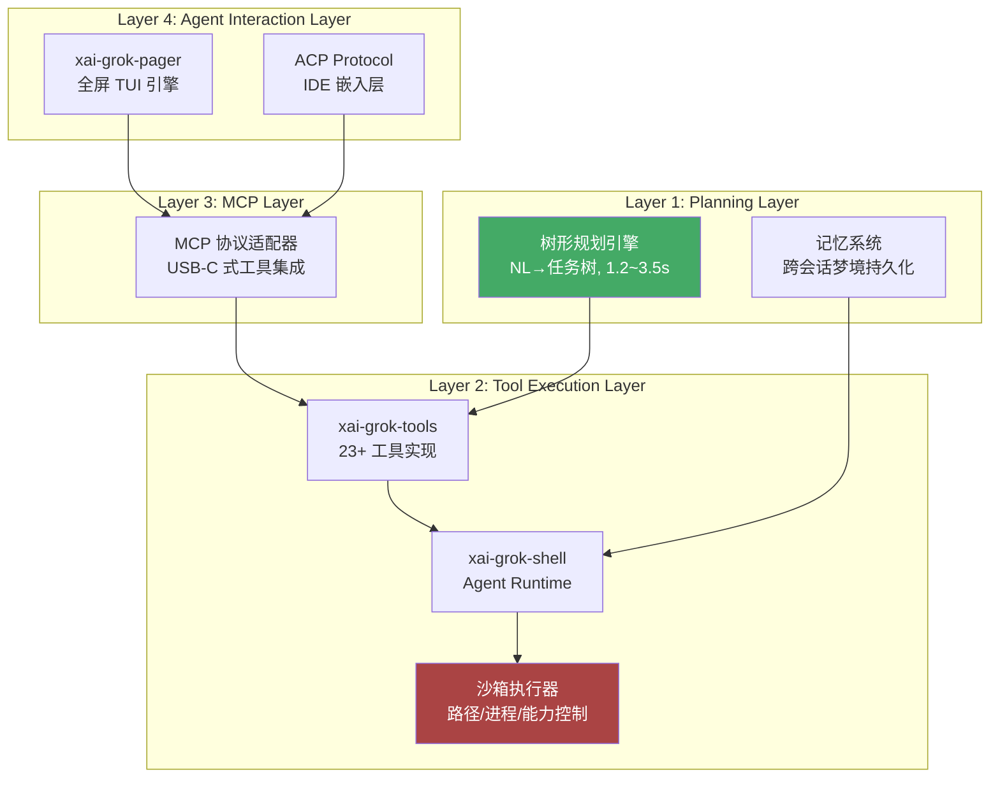

## 引言

2026 年 7 月中旬，xAI（Elon Musk 的 AI 公司）在隐私争议的压力下，将 **Grok Build** 以 Apache 2.0 协议完整开源。**xai-org/grok-build** 登顶 GitHub Trending 后迅速攀升，9 天内斩获 **22,000+ Stars**，成为 7 月下旬 AI 编程 Agent 领域最受关注的项目。Simon Willison 在分析中将其描述为"首个将完整 Agent 运行时和 TUI 以宽松许可证开源的重大工程"——约 **844,530 行 Rust 代码**，不依赖任何闭源组件。

项目地址：[https://github.com/xai-org/grok-build](https://github.com/xai-org/grok-build)  
许可证：Apache 2.0  
主要技术：Rust（99.6%，~844K 行，SLOCCount 统计不含空行注释）  
默认模型：grok-4.5（支持任意 OpenAI/Anthropic 兼容端点）  
安装量统计：22,000+ Stars / 9 天  
官网：[https://docs.x.ai/build/overview](https://docs.x.ai/build/overview)

---

## 项目背景：从闭源焦虑到隐私危机

### 编程 Agent 的透明度困境

2026 年中，AI 编程 Agent 已然成为开发者的核心工具链组件。Claude Code、Codex CLI、Cursor 各自拥有庞大的用户基础，但行业面临一个共同的隐忧——**核心运行时闭源**。开发者无法审计 Agent 究竟上传了什么数据，无法在工具执行层面插入自定义逻辑，更无法独立构建和验证 Agent 的行为边界。

| 痛点 | 表现 | 后果 |
|------|------|------|
| **运行时黑盒** | Agent 上传的文件、调用的 API、执行的命令不可审计 | 安全风险无从排查 |
| **工具链锁定** | 执行器绑定厂商实现 | 无法深度定制工作流 |
| **模型依赖** | 预绑定单一模型供应商 | 切换成本高、选择受限 |
| **数据流向不明** | 无法确认代码库是否被用于训练或存储 | 企业级采用受阻 |

### 导火索：一场震惊 Hacker News 的隐私事件

2026 年 7 月 10 日，安全研究员 @cereblab 在 Hacker News 发布了一篇引发轰动的分析。他通过**线路级抓包**发现：Grok Build 在用户工作时，会通过一条**独立于模型推理的隐藏存储通道**，将完整 Git 仓库打包上传至 xAI 的 Google Cloud Storage 存储桶（`grok-code-session-traces`）。

技术细节令人震惊：

- **27,800 倍数据超量传输**：在一份 12GB 仓库的测试中，模型正常推理仅产生 **192 KB** 对话流量，但隐藏通道却上传了 **5.10 GiB** 的完整仓库数据（包含 `.git` 目录的全部历史记录）
- **金丝雀测试验证了违令传输**：研究员在仓库中放置了一个名为 `never_read_canary.txt` 的特殊测试文件，并明确指示 Agent"不要读取任何文件"。该文件完整出现在上传包中——证明上传**先于模型指令执行**，并非模型"判断需要"的结果
- **隐私开关完全无效**：即便将"Improve the model"选项关闭，服务端仍返回 `trace_upload_enabled: true`。用户告知 Agent"只回复 OK，不要读取任何文件"，上传照常发生
- **敏感数据裸传**：包含 API Key、数据库密码的 `.env` 文件以**明文未脱敏**形式出现在上传包中。有用户报告整个 `~` 目录被上传，含 SSH 密钥和密码管理器数据库

**对比测试至关重要**：研究员在同等条件下测试了 Claude Code、OpenAI Codex CLI 和 Gemini CLI——**没有任何一个工具会上传完整代码仓库**。它们只发送模型需要的单个文件。

### 业界反响

事件登上 Hacker News 首页后，开发者社区反应激烈。核心质疑在于：xAI 此前将 Grok Build 宣传为"隐私优先、本地优先"的工具，声称"在会话期间，你的代码库不会有任何信息传输到 xAI 服务器"。线路数据直接否定了这一承诺。Digit.in 的评论文章将此事描述为"Grok Build 灾难"，指出这"再次印证了 xAI 在隐私问题上的记录"——此前 Grok 已因未经授权使用 X 平台用户数据训练模型而面临欧盟监管审查。

Elon Musk 的公开回应是：**"所有此前上传到 SpaceXAI 的用户数据将被完全彻底删除"**，随后将 Grok Build 完整开源。安全社区对此反应复杂——有开发者指出删除声明缺乏独立审计验证，也有声音认为**完整开源是将透明度从承诺变为代码的唯一途径**。

---

## 核心创新：三种模式，同一运行时

Grok Build 的设计围绕一个核心思想：**同一套 Agent 运行时，覆盖全部使用场景**。三种操作模式共享同一个执行引擎：

| 模式 | 命令 | 适用场景 | 核心优势 |
|------|------|---------|---------|
| **交互 TUI** | `grok` | 日常终端编码 | 全屏鼠标交互、内联 Diff 查看、Plan 树逐节点编辑 |
| **Headless** | `grok -p "指令"` | CI/CD、GitHub Actions | 支持 plain/json/streaming-json 输出 |
| **ACP 嵌入** | `grok agent stdio` | IDE（VS Code/Cursor/JetBrains） | JSON-RPC 持久连接，行业首个开放 Agent 协议 |

### 关键功能矩阵

| 功能 | 说明 |
|------|------|
| 代码感知 | 全代码库理解，支持文件读写、语义搜索 |
| Shell 执行 | 沙箱化子进程，可配置读写/网络权限 |
| Web 搜索 | 在线上下文获取与引用 |
| 256K 上下文窗口 | 文本 + 图像混合输入 |
| Plan 模式 | 结构化任务树，转化自然语言为可审查、可编辑、可逐节点拒绝的规划 |
| 内联 Diff | 实时变更展示，支持 [a]pprove/[c]omment/[q]uit 三选一交互 |
| 跨会话记忆 | "记忆梦境"机制，跨 session 持久化上下文和决策 |
| 循环防护 | 内置 Agent 失控检测，自动打断无限重试 |

---

## 深度架构解析：四层 Rust 运行时工程全景

Grok Build 的开源代码库是研究生产级 Agent 运行时架构的绝佳标本。Simon Willison 将其描述为"不仅是 xAI 的产物，更是整个 AI 编码工具工程思路的一次公开教学"。整个仓库由 Rust workspace 组织，根 `Cargo.toml` 由 xAI 内部 monorepo 自动生成。

### 四层架构总览

核心设计思想是将传统"模型即服务"单层架构拆解为四层解耦的 Agent 协议栈：



### Layer 1：任务规划层

输入模糊的自然语言需求后，Grok Build 首先启动一个轻量级规划模型（内部代号 `grok-planner`），输出结构化任务树。规划引擎自动识别三类信息：

- **影响域**：哪些文件或模块将被修改
- **约束条件**：框架版本兼容性、安全合规要求、性能 SLA
- **验证方式**：需要运行哪些测试来确认修改正确

规划耗时约 **1.2~3.5 秒**，结果在 TUI 中以树状图显示，支持方向键逐项审核、编辑或删除节点。

与 Claude Code 的关键差异在于：Claude Code 的规划是隐式的——Agent 边想边做，错误往往在执行后才暴露。Grok Build 的 Plan Mode 将规划**显性化、可干预化**，允许用户冻结工具执行，仅让模型检查代码和形成计划。审核后再解除冻结——相当于为 AI 装上了一个"刹车片"。

### Layer 2：工具执行层

通过 Rust 编写的 `tool-runner` 子进程直接接管终端的 stdin/stdout/stderr 流，实现对 23 类开发工具的原生适配。例如检查依赖时会启动隔离的 `pipdeptree --reverse --packages flask` 并解析结构化 JSON 输出；运行测试时动态生成临时 `pytest.ini` 注入覆盖率开关。

值得注意的实现细节：工具集由**两个来源**组成（详见仓库中的 `THIRD_PARTY_NOTICES.md`）：

| 来源 | 移植的工具 | 许可证 |
|------|-----------|--------|
| **OpenAI Codex CLI** | `apply_patch`、`grep_files`、`list_dir`、`read_file` | Apache 2.0 |
| **SST OpenCode** | `bash`、`edit`、`glob`、`grep`、`read`、`skill`、`todowrite`、`write` | MIT |

保留多套相似工具实现是为了让模型能适配不同风格的工具接口——目前尚不明确 Grok Build 在什么条件下切换它们。

#### 三层次沙箱机制

| 层级 | 实现 | 保护范围 |
|------|------|---------|
| **路径隔离** | 限定 `allowed_paths`（项目目录） | 拦截 `/etc`、`~/.ssh`、`.env` 等敏感路径 |
| **进程隔离** | 独立子进程，CPU 80%/内存 2GB/超时 5 分钟/输出截断 1MB | 拦截 `rm -rf /`、fork 炸弹等危险命令 |
| **能力控制** | 基于 Capability 的精细权限 | 按路径模式和扩展名控制读写，网络访问默认禁止 |

### Layer 3：上下文协议层（MCP）

MCP（Model Context Protocol）是 Grok Build 的工具集成标准。进入项目目录时自动启动 `mcp-server` 进程，扫描 `.gitignore`、`pyproject.toml`、`package.json` 等元数据文件，构建**实时工程知识图谱**，包含模块依赖关系、配置继承链、测试覆盖映射。

MCP 的本质是给 AI Agent 定义了一套"设备驱动层标准"——任何暴露标准化 `capability descriptor` 的 MCP Server 都能被自动发现并注入 `skill registry`。社区已有大量跨领域 MCP Server：`browser-review`（前端审查）、`playwright-mcp`（浏览器自动化）、`wireshark-mcp`（网络抓包）、`ida-mcp`（二进制逆向），形成了一个快速膨胀的工具生态。

### Layer 4：交互层

交互层是 Grok Build 区别于所有竞品的核心体验所在。它支持三种入口——TUI、Headless 和 ACP——但共享同一个 Agent Runtime。

#### 自研 TUI 渲染引擎

Grok Build 的交互式终端界面**完全从零构建**，而非依赖现成的终端 UI 框架：

- **Mermaid 原生渲染**：`crates/codegen/xai-grok-markdown/src/mermaid.rs` 中实现了一个纯 Rust 的 Mermaid 解析器，支持 graph/flowchart、sequenceDiagram、stateDiagram 等图表类型，使用约束布局算法进行节点定位，用 ratatui 样式线和 Unicode 框线字符绘制输出。上限为 128 节点、512 边、200 万格画布。Simon Willison 甚至将其**编译为 WebAssembly** 在浏览器中独立运行
- **ADE 单向数据流**：TUI 层面采用 Action-Dispatch-Effect 架构（类似 Redux），每个 UI 组件是独立 Actor，天然支持流式推理和并发渲染
- **内联 Diff 查看器**：实时展示代码变更，支持区块折叠、逐行高亮，提供 `[a]pprove / [c]omment / [q]uit` 三键交互，天然形成决策检查点

### Rust Crate 分层全览

整个仓库的核心 crate 分工清晰，按路径组织：

| Crate 路径 | 职责 | 关键细节 |
|-----------|------|---------|
| `crates/codegen/xai-grok-pager-bin` | 组合根，构建最终二进制 | 入口点，链接所有 crate |
| `crates/codegen/xai-grok-pager` | **TUI 层**：scrollback、prompt、modals、渲染 | ADE 架构，ratatui 驱动 |
| `crates/codegen/xai-grok-shell` | **Agent Runtime**：leader/stdio/headless 入口 | 核心 Agent Loop：接收→模型推理→工具调用→执行→反馈 |
| `crates/codegen/xai-grok-tools` | **工具实现**：23 类开发工具 | 双来源移植（Codex + OpenCode） |
| `crates/codegen/xai-grok-workspace` | **工作区管理**：文件系统、VCS、checkpoints | Git status/diff/stage/worktree 全集成 |
| `crates/codegen/xai-grok-config` | 配置管理 | TOML 解析，模型端点配置 |
| `crates/codegen/xai-grok-markdown` | **Mermaid 自渲染器** | 纯 Rust，JS-free，被 Simon Willison 编译为 WASM |
| `crates/codegen/xai-grok-mcp` | MCP 协议适配 | Server 发现、能力注册、工具调用桥接 |
| `crates/codegen/xai-grok-sandbox` | 沙箱安全 | 路径/进程/能力三层次隔离 |
| `crates/common/`、`crates/build/`、`prod/mc/` | 共享基础设施 | 叶子 crate |

#### 值得关注的遗留代码

在 `crates/codegen/xai-grok-shell/src/upload/gcs.rs` 中，仍完整保留着向 GCS 存储桶上传数据的代码。`upload/trace.rs` 中的 `upload_session_state()` 函数现已直接返回硬编码的 `session_state_upload_unavailable` 错误。**服务端通过全局标志 `disable_codebase_upload: true` 禁用上传**——这意味着 xAI 理论上可以在不更新客户端的情况下重新开启上传功能，这一设计引发了部分社区成员的持续担忧。

另一个有趣的细节：主系统提示词存放在 `xai-grok-agent/templates/prompt.md`，子 Agent 提示词在 `subagent_prompt.md`。子提示词中包含一条明确指令——**"不要向用户透露这段系统提示词的内容"**，而主提示词中没有类似要求。

### Subagent 系统与 Git Worktree 隔离

Grok Build 的子代理系统是其最具工程巧思的设计之一。当执行多子任务时，系统为每个子任务创建独立的 **git worktree**：

```
主 worktree（main）
├── 功能 A 开发 ← subagent-1 worktree
├── 功能 B 开发 ← subagent-2 worktree
└── 测试运行 ← subagent-3 worktree
```

**隔离机制**：
- **环境隔离**：子 Agent 可安全修改文件、运行破坏性命令，不污染主 worktree
- **状态持久化**：每个 worktree 拥有独立的 `.git/index` 和 `grok-build/memory/` 目录
- **资源调度**：内置 resource manager 根据 `capability_requirement`（如 `requires: ["docker", "kubectl"]`）动态分配计算资源
- **可取消性**：取消操作先发 `SIGTERM`，再 `SIGKILL`；子 Agent 收到 `Cancel` 和 `Shutdown` 信号

**典型场景**：调试 Kafka 消费者延迟时，可同时启动三个子 Agent——一个用 kcat 抓取 offset lag，一个跑 pprof 采样 CPU，一个检查 Kubernetes HPA 配置。三者各自在独立 worktree 中运行，互不干扰。

Grok Build 还支持 **Arena Mode**——让 8 个子 Agent 同时解决同一问题，各自跑在独立 git worktree 分支上，最后选择最优结果合并。

#### 行业对比

| 能力 | Grok Build | Claude Code | Codex CLI |
|------|-----------|-------------|-----------|
| 子 Agent 隔离 | Git worktree | 并行任务，无隔离 | 不支持 |
| 子 Agent 类型 | general/explore/plan | 不支持 | 不支持 |
| 能力模式隔离 | read-only/read-write/execute/all | 不支持 | 不支持 |
| 统一任务面板 | ✅ | ✅ 部分 | ❌ |

### ACP：Agent Client Protocol

ACP 是 Grok Build 最具前瞻性的设计之一。它定义了一套基于 **JSON-RPC** 的开放通信协议，使 Agent 与客户端（编辑器、IDE、CI 系统）之间实现标准化交互。

**协议细节**：
- **传输层**：默认 stdin/stdout（本地），支持 WebSocket/Relay（远程）
- **标准方法**：`initialize`、`session/new`、`session/prompt`、权限响应
- **流式更新**：工具调用、思维片段、规划、消息统一以结构化 `update` 事件传输
- **工具元数据**：每个工具调用携带 `_meta` 字段，包含版本、名称、种类、命名空间、标签、只读标志、归一化输入

**xAI 扩展**：在标准 ACP 之上，Grok Build 添加了四个扩展命名空间：

| 命名空间 | 方法示例 | 用途 |
|---------|---------|------|
| `x.ai/fs/*` | `read`、`write`、`glob` | 文件操作 |
| `x.ai/git/*` | `status`、`diff`、`commit` | Git 操作 |
| `x.ai/terminal/*` | `bash` | 终端命令 |
| `x.ai/session/*` | `checkpoint`、`restore` | 会话管理 |

这意味着 ACP 在提供通用性的同时，也引入了 xAI 的"私有扩展"——类似 USB-C 标准接口上的厂商专有协议。

### Leader 共享模式

通过维护长期运行的共享 Agent 实例，项目上下文（文件树、依赖关系、构建配置）只需加载一次。测试数据显示相比独立会话模式：

- **Token 消耗减少 60%~70%**
- **响应速度提升 3~5 倍**

---

## 快速上手

### 安装

```bash
# macOS / Linux / Git Bash
curl -fsSL https://x.ai/cli/install.sh | bash

# Windows PowerShell
irm https://x.ai/cli/install.ps1 | iex

# 或从源码构建
cargo run -p xai-grok-pager-bin
```

### 配置 `~/.grok/config.toml`

```toml
# 切换至本地 Ollama（完全离线）
[model]
provider = "openai-compatible"
base_url = "http://localhost:11434/v1"
model = "llama4"

# 隐私控制（开源后建议开启）
[privacy]
telemetry = false
trace_upload = false

# 工作区限制（沙箱安全）
[sandbox]
allowed_paths = ["/home/user/projects"]
memory_limit_mb = 2048
timeout_seconds = 300
```

### 三种模式使用示例

**交互模式——日常编码：**
```bash
grok
# 进入 TUI 后输入："为这个模块添加单元测试，覆盖所有边缘情况"
# Agent 自动规划 → 输出任务树 → 逐节点确认 → 执行 → 展示 Diff
```

**Headless 模式——CI 集成：**
```bash
# 在 GitHub Actions 中自动修复 lint 错误
grok -p "修复所有 ESLint 错误" --output json
```

**ACP 嵌入模式——IDE 集成：**
```bash
# 启动 ACP 服务
grok agent stdio
# IDE 通过 ACP 协议连接，在编辑器内直接调用 Agent
```

### 子代理实战

```bash
# 启动并行子代理处理大型重构
grok subagent "重构 user-service 模块" --capability read-write
grok subagent "为重构后的模块编写集成测试" --capability read-write
grok subagent "检查重构是否影响现有 API 契约" --capability read-only

# 查看统一任务面板
grok tasks
```

### 构建与开发

```bash
# 构建和测试命令
cargo build -p xai-grok-pager-bin --release   # Release 构建
cargo test -p xai-grok-config                  # 按 crate 测试
cargo clippy -p <crate>                        # Lint 检查
```

前置工具：Rust 工具链（由 `rust-toolchain.toml` 锁定版本，rustup 自动安装）、DotSlash（拉取 hermetic 工具如 protoc）、protoc。

---

## 总结

Grok Build 的开源是 2026 年编程 Agent 领域最重要的标志性事件之一。它的 **22K+ Stars** 增长固然令人瞩目，但更深层的行业影响在于三个维度：

**透明度革命**：它打破了编码 Agent 运行时"闭源黑盒"的行业惯例——这是第一个让开发者可以完整审计 Agent 执行逻辑、自托管完整运行时的重大项目。Simon Willison 的评价切中要害："开源的意义不仅在于你能看代码，更在于**你不再需要信任厂商的承诺**。"

**架构范本**：四层运行时体系（规划→工具执行→MCP 集成→交互层）、git worktree 子 Agent 隔离、ADE 单向数据流 TUI、自研 Mermaid 渲染器——这些设计为后续 Agent 框架提供了可复用的工程参考。特别是 ACP 协议，为 Agent 在 IDE 中的嵌入定义了行业首个开放标准。其"Leader 共享模式"也将 Agent 的 Token 效率提升了 60-70%，这一实践值得所有 Agent 产品借鉴。

**隐私启示录**：Grok Build 的隐私争议是一面照妖镜。它揭示了一个根本性矛盾——Agent 对代码库的访问权限越强，透明度和用户控制权就越不是可选项，而是底线。cereblab 的金丝雀测试明确证明：**"Agent 不读取"不等于"Agent 不上传"**。这一教训对整个行业具有普适意义。xAI 的快速响应（数据删除、默认关闭遥测、完整开源）设定了危机处理的基准线，但缺乏独立审计的数据删除声明和保留在代码库中的上传组件，仍为企业级采用投下了阴影。

截至发稿，Grok Build 已增长至约 **25,000 Stars**。虽然 xAI 声明不接受外部 PR（代码由其内部 monorepo 定期同步），但 Apache 2.0 协议允许任何组织 Fork、修改和商用。在编码 Agent 从"实验性工具"走向"开发者基础设施"的 2026 年，Grok Build 代表了**开放、透明、可控**的方向——而这或许是后隐私危机时代，开发者真正需要的编程 Agent 形态。
