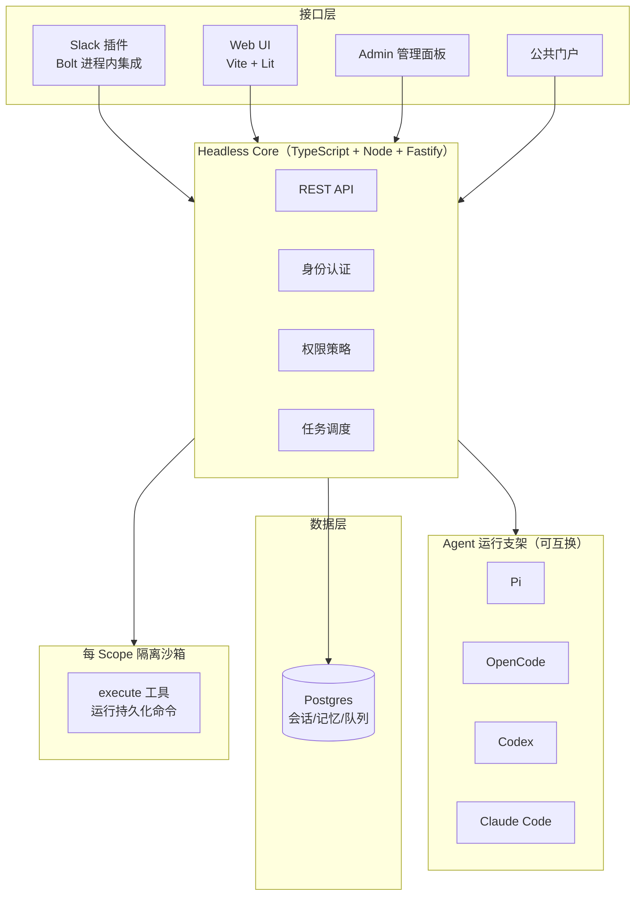

## 引言

本周 GitHub Trending 上，**yc-software/qm** 以约 **12,100 Stars** 登顶榜单第一，同时霸占 Hacker News 首页（505+ 分）。这个项目由 **Y Combinator** 于 7 月底开源，是 YC 内部真实使用的**多人 Agent 协作框架（Multiplayer Agent Harness）**，而非一个玩具 Demo。

- 项目地址：[https://github.com/yc-software/qm](https://github.com/yc-software/qm)
- 许可证：MIT
- Stars：12.4K（Forks 1.4K，68 commits）
- 技术栈：TypeScript（Node.js）+ Postgres
- 作者：[Y Combinator](https://github.com/yc-software)

QM 的定位可以用一句话概括：**把 Agent 从"个人外脑"变成"公司工位"**。当 Claude Code、Codex 这类编码 Agent 都在解决"一个开发者如何更高效"，QM 解决的却是另一个问题——**当几十人共用一批 Agent 时，记忆、文件、密钥、权限、沙箱该如何隔离与协作**。

而 YC 官方坦诚地说：这个项目"尚处于早期阶段，存在 bug"。但它是 YC 在部署了 50+ 个个人 Agent 后发现无法扩展，转而亲手自建的真实基础设施。

---

## 项目背景：Agent 从"个人助手"走向"组织基础设施"

### 单人 Agent 的繁荣与团队场景的空白

2026 年的 Agent 生态已经极其繁荣：Claude Code、Codex、OpenCode、Cursor 等编码 Agent 日臻成熟，个人开发者用它们写代码、跑测试、开 PR。但所有这些工具都共享同一个假设——**一个用户、一个上下文、一台机器**。

当 Agent 进入团队场景，问题立刻浮现：

- **权限无法细分**：一个 Agent 要么能访问全部仓库，要么什么都做不了
- **记忆互相污染**：多人共用同一 Agent，A 的上下文会泄露给 B
- **密钥管理混乱**：团队成员各自配 API Key，没有统一的凭证体系
- **审计缺失**：Agent 代表谁执行了哪些操作？无从追溯

### YC 的自建之路

最有力的背景来自 YC 自身：它曾部署了 **50+ 个 Hermes 个人助手**，但在尝试将其扩展到全公司场景时遭遇瓶颈。个人助手的架构假设是"一个用户一个实例"，当会计、法务、活动、工程四条业务线都要接入 Agent 时，隔离、共享、治理的问题被无限放大。

于是 YC 决定自研。这个背景解释了 QM 设计哲学的核心——**它不是被"设计"出来的产品，而是被"逼"出来的基础设施**。

### 2026 年的范式转折

QM 的爆发恰逢一个社区共识的形成：GitHub 社区不再问"Agent 能不能做这件事"，而是问"多个 Agent 能不能安全地一起为团队做事"。权限系统、共享记忆、审计轨迹、运行支架抽象——这些基础设施层正在快速成熟，而 QM 是本周冲在最前面的那个。

---

## 核心创新：Scope 优先，而不是 User 优先

QM 最核心的设计决策，是把 **Scope（作用域）** 而非 User（用户）作为一等公民。

### 双空间模型

| 空间类型 | 提供什么 |
|---------|---------|
| **个人 Scope** | 每个员工拥有完全隔离的工作区——专属记忆、文件、密钥链、权限、Cron 定时任务、Web App 和持久化沙箱 |
| **共享 Room** | 每个 Slack 频道、群组、项目拥有自己的 Scope，成员共享该 Room 的 Agent、文件和记忆 |

这意味着：同一员工可以有自己的私人 Agent，也可以被拉进一个共享频道，与团队共享频道级 Agent——两个空间的记忆、文件、权限**彻底隔离，绝不混合**。

### 多维功能对比

| 维度 | QM | 个人编码 Agent（Claude Code/Codex） | 传统团队协作（Slack+wiki） |
|------|----|-------------------------------------|---------------------------|
| 隔离粒度 | ✅ Scope 级（人/频道/项目） | ❌ 单一用户上下文 | ❌ 无 Agent 概念 |
| 共享协作 | ✅ 频道/群组/项目共享 Agent | ❌ 单人 | ✅ 但无 Agent 参与 |
| 密钥管理 | ✅ Scope 级 keychain | ❌ 各自为战 | ❌ |
| 后台任务 | ✅ Cron + Watch 自主运行 | ❌ | ❌ |
| 权限治理 | ✅ 组织级策略 + 单向收紧 | ❌ | ❌ 人工 |
| 审计 | ✅ 全量记录 + 动态过滤 | 部分 | ❌ |
| 运行支架 | ✅ Harness 无关（Pi/Codex/Claude Code 可换） | ❌ 单一厂商 | ❌ |
| 沙箱 | ✅ 每 Scope 持久化沙箱 | ✅ 本机 | ❌ |
| Web App 发布 | ✅ 构建内部工具并发布给指定人群 | ❌ | ❌ |

### 关键创新点

1. **Slack + Web 双端同一身份**：不是两套系统，而是同一套身份和配置在两个界面上延续
2. **共享 Skills**：技能归 Scope 所有、可按授权共享，管理员可审批推广至全组织；支持从 git 仓库导入技能包
3. **后台工作**：Cron 和 Watch 在"没人看着的时候"自主运行任务
4. **Web App**：Agent 可以直接构建内部工具并发布给特定受众
5. **Admin 控制**：组织级配置、安全姿态设置、可用 Harness 与模型管控——模型选择是组织策略而非个人偏好

---

## 深度架构解析

### 整体架构



### 分层设计

| 模块 | 技术选型 | 职责 |
|------|---------|------|
| Headless Core | TypeScript on Node.js + Fastify | API、身份、策略、调度中枢 |
| 存储层 | Postgres | 会话历史、记忆、任务队列 |
| 沙箱层 | 每 Scope 持久化环境 | `execute` 工具在隔离环境运行命令，已装工具跨会话保留 |
| 接口层 | Slack（Bolt）/ Web UI（Vite+Lit） | 同一身份双端延续 |
| 部署层 | Deployment Directory + `qm` CLI | 组织专属配置的校验与部署 |

### Harness 无关：避免供应商锁定

QM 的核心设计之一，是**运行支架可互换**：Pi、OpenCode、Codex、Claude Code 都可以驱动同一个 Core。你可以在一个部署里混合使用不同 Agent，也可以随时切换——模型和工具链的选择权在组织，而非被单一厂商绑架。

所有主要子系统（harness、session store、sandbox、memory）都**坐在接口后面**，生产实现通过一个 wiring 文件替换即可。

### 安全模型：治理代码是调度代码的 2 倍

最说明问题的数据来自 QM 的源码结构：**13 个文件实现 Agent 循环，26 个文件实现访问控制、身份认证、审计、策略、凭证和安全**。管"谁能看什么"的代码量，是管"怎么调模型"的两倍。

三种组织级安全姿态（Scope 只能单向收紧，不能放宽）：

| 姿态 | 行为 |
|------|------|
| **Strict** | 每次工具调用都暂停等待人工审批 |
| **Auto（默认）** | 分类器在外部数据进入模型前，先筛查带来源标签的数据和工具结果 |
| **Dangerous** | 不筛查、不停顿——但预声明的命令拒绝策略（如递归删除、破坏性 SQL）仍然生效 |

此外还有两个值得注意的工程细节：

- **出站代理（Egress Proxy）**：独立授权代理，使用 JWS 签名能力令牌，专门阻止云元数据端点（如 `169.254.169.254`）访问，并封堵 DNS 重绑定攻击
- **动态笔录过滤**：多人场景下，`filterTapeForAudience` 会根据查看者权限对会话记录动态过滤——无权消息用占位符替代而非直接删除，保持对话结构完整

### 私有 Fork：组织定制而不泄露

对想要完整代码库但又需保持定制私有的组织，QM 提供了**私有 Fork 方案**——明确不使用 GitHub 的 Fork 按钮（因为 Fork 会继承源仓库可见性并共享对象网络），而是用普通 clone 镜像创建私有仓库。组织定制放在 `deploy/layers/<org>/` 下，核心保持与上游逐字节一致，用 `update-qm` 和 `upstream-pr` 两个 Skill 维护边界。

---

## 快速上手

### 初始化部署仓库

QM 的部署方式与其他项目不同——它不是 clone 源码，而是**物化一个部署目录**：

```bash
npm exec --yes --package=@yc-software/qm@latest -- \
  qm init . --org <your-slug> --target <fly-or-aws>

npm install
```

这个命令会生成完整的部署仓库，并引导你完成：基础设施创建 → 登录配置 → 连接器凭证 → 可选 Slack 接入 → 部署 → 验证。**无需源码检出**。

每个部署运行在组织自己的云账户中，支持 **Fly** 和 **AWS** 两种目标。

### 典型使用场景

QM 的实际应用场景覆盖了团队工作的方方面面：

- **跨源搜索**：同时检索内部笔记、邮件、文档、数据库和网页
- **知识库问答**：从公司知识库中检索信息
- **内部工具构建**：构建并发布带实时数据的内部 Web App
- **收件箱智能分类**：学习你的写作风格，按计划自动给收件箱打标签并起草回复
- **代码仓库操作**：运行测试、开 PR、监控 CI、查看日志
- **项目追踪**：在共享频道中跟踪项目进展、更新和跟进

---

## 总结

**12.1K Stars、HN 榜首 505 分、YC 官方下场**——QM 的爆发是 2026 年"Agent 基础设施"趋势的标志性事件。

它精准命中了三个时代痛点：**单人 Agent 的架构天花板**（无法扩展到团队）、**多 Agent 协作的隔离难题**（记忆/密钥/权限），以及 **供应商锁定焦虑**（Harness 无关设计）。而 YC "用 QM 开发 QM 自身"的实践——可能是首个公开的"Agent 框架用自己的 Agent 写自己"案例——则为这个项目提供了最有力的背书。

但也要冷静看待：QM 官方承认"尚处于早期阶段，存在 bug"。它的适用对象也有限定——**10~500 人、至少配备 1 名平台工程师**的初创或中型公司，需要自有云账户和 Postgres。它不是个人工具，而是**组织基础设施**。

真正值得关注的信号，是社区对 QM 的集体拥抱所代表的范式转向：**2026 年的 Agent 不再是一个人的副驾驶，而是一个组织的协作层**。当治理代码成为 Agent 基础设施的核心资产，我们看到的不是模型的进步，而是**工程化的胜利**。

---

*本文基于 [yc-software/qm](https://github.com/yc-software/qm) 仓库 README、SECURITY.md、官方文档及 GitHub Trending、Hacker News 数据编写，数据截至 2026 年 8 月 8 日。*
